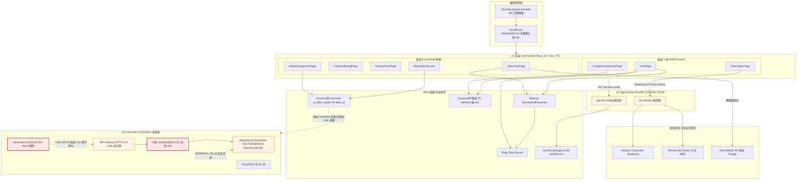
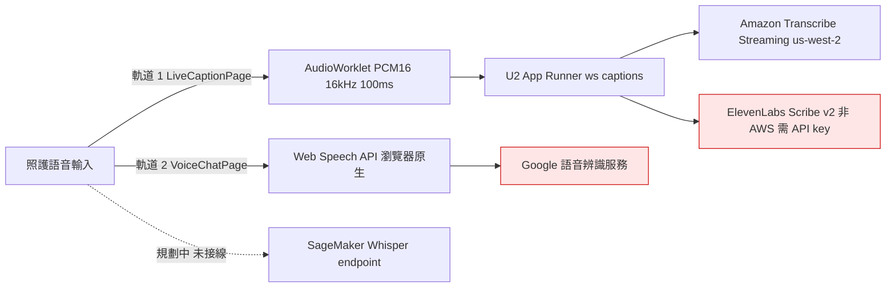
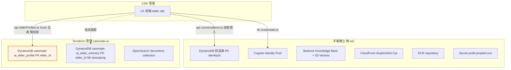

# 架構文件同步 — 技術設計文件

> **Spec**：`v3-architecture-sync`
> **類型**：Feature / Design-First
> **產出物**：High-Level Design + Low-Level Design
> **重寫日期**：2026-08-02
> **基準 commit**：`2c40406 [feat] 整合 CareMate AI 全部功能 + AWS 基礎設施`
> **Pipeline 階段**：Quality Stage 2（Design）

---

## 0. 本文件為重寫版

前一版 design.md 以「單一 v3 混合架構」為前提撰寫。該前提在兩個 commit 後已不成立：

| Commit | 影響 |
|---|---|
| `f0d38d6` 整合 CareMate AI 智慧長照陪伴系統 (#16) | 新增 `caremate-ai/` 82 檔 / 16,618 行，帶進**第二套完整架構**（Terraform + API Gateway + Lambda + OpenSearch Serverless） |
| `2c40406` 整合 CareMate AI 全部功能 + AWS 基礎設施 | 把 CareMate 功能移植進 root `frontend/`（改寫為 TSX），新增 10 檔 / 4,367 行；並新增 `docs/architecture-v3.md` |

所有事實已於本次重新驗證。工作區乾淨（僅 `docs/dispatch-v2-plan.md` 有未提交修改與本 spec 目錄）。

---

## Overview

### 1.1 問題陳述

repo 的敘述性文件與程式碼的落差已經不是「過時」，而是**主動誤導**，並且落差在最近兩個 commit 後急遽擴大：

1. `.kiro/steering/PIPELINE.md` 的 `Project Context` 是 v1 描述，且 `inclusion: always` — **每一次對話都注入**。諷刺的是它寫的 Lambda / API Gateway / OpenSearch Serverless 因 `caremate-ai/` 的加入而**部分變成事實**，但仍不對應主線系統，這讓錯誤更難察覺。
2. `docs/architecture.md` 仍稱「此架構沒有後端層」，並據此推導安全結論。前提已錯，結論連帶失效。
3. `docs/architecture-v3.md`（新增，291 行，品質良好）是目前最接近現實的文件，但它**寫在 `2c40406` 之前**：只列 5 個頁面（實際已 9 個以上）、未涵蓋 `caremate-ai/`、未涵蓋 Web Speech API 這條新的語音路徑，且其安全旗標 R5 已不成立（見 §6.4）。
4. `README.md` 的 Project Structure 列出 12 個不存在的檔案，Backend 一行三處錯誤，且完全未提 `caremate-ai/`。
5. 「整合」一詞在 commit message 中出現兩次，但**兩次的整合程度不同**，且都尚未完成（見 §2.4）。文件若沿用「已整合」的敘述會嚴重高估系統成熟度。

### 1.2 目標

1. 建立**單一權威架構來源**，準確描述目前的三部署單元 / 雙 IaC / 雙功能軌現況。
2. 修正所有下游文件與 steering，使其與程式碼一致，並**按系統分段**（因為同一條規則對不同系統的適用性不同）。
3. 補上 ADR 記錄尚未有紀錄的架構決策，特別是三條並存的語音辨識路徑。
4. 建立**自動化防漂移機制**，並修好目前完全不會執行的 CI。
5. 向 Stage 6 compliance-auditor 提交「架構事實更正說明」供其重新評級（**本 spec 不改判**）。

### 1.3 非目標

- **不修復**安全弱點本身（認證、authorizer、region 白名單、S3 公開存取、資料隔離）。本 spec 負責**正確記錄**並產出可執行的修正設計；實作屬另一 feature。
- **不改寫** audit report 的嚴重度判定（權責見 §8）。
- **不刪除** `LiveCaption/`（已證實在服役）或 `caremate-ai/`（未經使用者確認）。
- **不決定**兩系統的長期去留 — 這是 §11 的最高層開放問題，需使用者決策後才能收斂架構。

---

## Architecture

> High-Level Design

### 2.1 版本認定：`v3` 這個標籤已經不夠用

`docs/architecture-v3.md` 把現況命名為 v3，但那份文件描述的是「單一混合架構」。`2c40406` 之後的現況是**三個部署單元、兩套 IaC、單一前端內含兩條互不相通的功能軌**。

本文件不擅自命名新版號（屬 §11 開放問題），一律以**部署單元代號**指稱：

| 代號 | 部署單元 | IaC | 狀態 |
|---|---|---|---|
| **U1** | root `frontend/` 靜態站 | CDK `frontend-stack.ts` | 服役 |
| **U2** | `LiveCaption/backend` FastAPI on App Runner | CDK `backend-stack.ts` | 服役 |
| **U3** | `caremate-ai/` Terraform 全套（API Gateway + Lambda + DynamoDB + OpenSearch + S3 + CloudFront） | Terraform | **未接線**（見 §2.4） |

### 2.2 整體架構圖



紅色 = 已接線但功能斷裂；橘色 = 無認證的對外暴露面。

### 2.3 U1 內部：兩條互不相通的功能軌

`2c40406` 把 CareMate 功能移植進 root `frontend/`，但**沒有與原有功能整合**，而是並列成第二條軌道。兩軌共用 `lib/config.ts` 與 `lib/credentials.ts`，其餘完全分離。

| 面向 | 軌道 1（原 Profit-Prophet） | 軌道 2（CareMate 移植） |
|---|---|---|
| 頁面 | ChatPage、CaregiverDashboardPage、LiveCaptionPage | VoiceChatPage、CareDashboardPage、MemoryViewPage、ElderSelectScreen、ElderManagementPage |
| 語音辨識 | `lib/useVoiceInput.ts` → U2 WebSocket → Transcribe Streaming | `hooks/useSpeechRecognition.ts` → **Web Speech API（Google）** |
| LLM | `api/bedrock.ts` RetrieveAndGenerate + 結構化輸出解析 | `VoiceChatPage` 內直接 `new BedrockAgentRuntimeClient` + `RetrieveAndGenerateCommand`；不可用時退回 `services/contextualChat.ts` |
| 對話生成 fallback | 無（失敗即報錯） | `services/contextualChat.ts` — **390 行規則式關鍵詞比對 + 模板**，非 AI |
| TTS | `api/polly.ts`（分句、每段上限 3000 字） | 由 `VoiceChatPage` 自行處理 |
| 資料儲存 | `api/conversations.ts` — DynamoDB，PK `identityId`，**client-side AES-GCM** | `api/elderProfiles.ts` — DynamoDB `caremate-ai_elder_profile`，PK `elder_id`，**無加密** |
| 資料讀取 | `Query` by `identityId` | **`Scan` 全表**，無任何使用者範圍限制 |
| 樣本資料 | 無 | `data/mockElders.ts` 726 行，經 `seedDefaultElders()` **寫入真實 DynamoDB** |
| 型別檢查 | 通過 | **`@ts-nocheck` 全數繞過** |

**這是本次同步最重要的架構事實**：所謂「整合全部功能」實際上是兩套功能並置。兩軌對同一件事（語音辨識、對話生成、資料儲存、加密、存取控制）採用**互相矛盾的做法**，且新軌的做法在每一項上都比舊軌寬鬆。

### 2.4 「整合」的兩層斷裂

commit message 稱已整合，但有兩處明確斷裂，皆可從程式碼直接驗證：

**斷裂 1 — `caremate-ai/frontend` 被 mock 鎖死**

`caremate-ai/frontend/src/services/api.js:20`：

```js
const USE_MOCK = import.meta.env.VITE_USE_MOCK === 'true' || true;
```

`X || true` 恆為 `true`，環境變數完全無效。該前端**所有** API 呼叫都走 `_mock*Response()` 本地假資料，**永遠不會**打到 U3 的 API Gateway。

**斷裂 2 — Knowledge Base 從未注入 Lambda**

`caremate-ai/infra/terraform/lambda.tf` 中 chat 與 speech 兩個 Lambda：

```hcl
BEDROCK_KB_ID = ""
```

Terraform 建立了 OpenSearch Serverless collection 與 `aws_bedrockagent_knowledge_base`，但 ID 硬寫成空字串，未由 Terraform 輸出接入。U3 的 RAG 實際不通。

**結論**：U3 是一套已用 IaC 完整定義、但兩端都未接線的系統。文件不得描述為「已整合」或「已上線」。

### 2.5 語音辨識：三條並存路徑（外加一條規劃中）

這是目前架構最需要收斂的地方，也是合規上最敏感的部分。



| 路徑 | 實作位置 | 資料邊界 | 狀態 |
|---|---|---|---|
| Transcribe Streaming | `lib/useVoiceInput.ts` → `LiveCaption/backend/app/services/transcribe.py` | AWS 內，us-west-2 | 服役 |
| ElevenLabs Scribe v2 | `LiveCaption/backend/app/services/elevenlabs_stt.py` | **送出 AWS 邊界**，需第三方 API key | 已實作，可切換 |
| Web Speech API | `hooks/useSpeechRecognition.ts` | **送往 Google**，瀏覽器原生 | 服役（軌道 2 唯一路徑） |
| SageMaker Whisper | `caremate-ai/infra/sagemaker/inference.py`、`scripts/deploy-whisper-sagemaker.py` | AWS 內 | 腳本存在，未接線 |

**合規影響**：後兩者中有兩條把照護語音送出 AWS 邊界。audit F-05 原本只針對 ElevenLabs，現在 Web Speech API 是**更嚴重的同類問題** — 它不需要任何設定切換，是軌道 2 的預設且唯一路徑，且 `useSpeechRecognition.ts` 的 docstring 自述使用 Google 語音辨識服務。這需要 ADR 明確決策或移除。

### 2.6 資料層與跨 IaC 耦合



**跨 IaC 耦合（新問題）**：`frontend/src/api/elderProfiles.ts` 把表名 `caremate-ai_elder_profile` **硬寫在程式碼中**，而該表由 `caremate-ai/infra/terraform/dynamodb.tf` 定義。也就是說 **CDK 部署的前端在執行期依賴 Terraform 管理的資源**，兩套 IaC 之間沒有任何契約或所有權邊界。若 Terraform 未 apply，`ElderSelectScreen` 與 `ElderManagementPage` 會在執行期失敗。

同時 `caremate-ai_elder_memory` 表被 Terraform 建立但前端從未讀寫 — U3 唯一會用它的是未接線的 Lambda。

### 2.7 IaC 覆蓋率矩陣

| 資源 | CDK | Terraform | 手動 |
|---|---|---|---|
| U1 S3 靜態站 + 部署 | ✅ | — | — |
| U2 App Runner + 2 個 IAM role | ✅ | — | — |
| U1 CloudFront `d1qintm5rk17ye` | — | — | ❌ 手動 |
| Cognito Identity Pool + IAM role | — | — | ❌ 手動 |
| 對話 DynamoDB 表（PK `identityId`） | — | — | ❌ 手動 |
| Bedrock Knowledge Base + S3 Vectors 索引 | — | — | ❌ 手動 |
| ECR repository | — | — | ❌ 手動（`import * as ecr` 未使用） |
| Secret `profit-prophet/env` | — | — | ❌ 手動（僅 IAM 讀取權在 CDK） |
| U3 API Gateway / Lambda / Layer | — | ✅ | — |
| U3 DynamoDB ×2（SSE + PITR + TTL） | — | ✅ | — |
| U3 OpenSearch Serverless collection + 3 policy | — | ✅ | — |
| U3 S3 ×3（KMS + BLOCK_ALL + OAI + lifecycle） | — | ✅ | — |
| U3 CloudFront | — | ✅ | — |
| SageMaker Whisper endpoint | — | — | 腳本，未納管 |

補充：`cdk.json` 的 `app` 只指向 `bin/frontend-stack.ts`，直接 `cdk deploy` **只會部署前端**，後端需顯式帶 `--app`。兩個 stack 各自 `new cdk.App()`，未共用 App。

**關鍵矛盾**：U3 的 S3 做法（三桶全 `BLOCK_ALL`、KMS 加密、CloudFront OAI、lifecycle）是**正確範本**；U1 的 `frontend-stack.ts` 卻是 `publicReadAccess: true` 且四個 `blockPublicAccess` 全 `false`，同檔註解還寫著「public read blocked per Constitution」。同一 repo 內兩種相反做法並存，這個對比本身就是 §3.7 修正案的依據。

### 2.8 能力重疊矩陣

| 能力 | 軌道 1 / U2 | 軌道 2 | U3（未接線） | 較佳範本 |
|---|---|---|---|---|
| 語音辨識 | Transcribe Streaming（經後端） | Web Speech API（Google） | SageMaker Whisper | 軌道 1（不出 AWS 邊界） |
| LLM | Bedrock RetrieveAndGenerate，Claude Haiku 4.5 | 同 API，另有規則式 fallback | Claude Sonnet 4 (`anthropic.claude-sonnet-4-20250514`) | 需統一，見 §11 |
| TTS | Polly Zhiyu Neural（分段） | 頁內自行處理 | Polly（Lambda） | 軌道 1 |
| 對話儲存 | DynamoDB + AES-GCM，PK `identityId` | — | `elder_memory`，PK `elder_id` + SK `timestamp`，無額外加密 | 加密取軌道 1，**排序取 U3** |
| 長者資料 | — | 前端直呼 DynamoDB，`Scan` 全表 | `profile` Lambda | U3（有伺服端中介） |
| RAG 向量庫 | S3 Vectors（手動） | — | OpenSearch Serverless（IaC） | U3（納入 IaC） |
| 前端託管 | S3 公開讀 + 手動 CloudFront | 同 | S3 BLOCK_ALL + OAI + IaC CloudFront | **U3** |
| 認證 | Cognito Identity Pool（允許 guest） | 同 | 無（API Gateway 無 authorizer） | 皆不合格 |

---

## Data Models

### 3.1 現行資料模型

**對話表（手動建立，PK `identityId`）** — `frontend/src/api/conversations.ts` 寫入：

```
identityId       string   PK，Cognito identity ID
id               string   crypto.randomUUID()
timestamp        string   ISO 8601
encryptedPayload { ciphertext, initializationVector, salt }
```

明文屬性僅 `identityId`、`id`、`timestamp`；所有語意欄位（`queryText`、`answer`、`category`、`confidence`、`candidates`、`citations`）都在 ciphertext 內。

**`caremate-ai_elder_profile`（Terraform，PK `elder_id`）** — `frontend/src/api/elderProfiles.ts` 讀寫：

```
elder_id      string  PK
name, age, gender, language, phone, address
emergency_contact, emergency_phone
diseases[], medications[], allergies[]
preferences{}, family_info{}
created_at, updated_at
```

**全部明文**，無加密層。

**`caremate-ai_elder_memory`（Terraform，PK `elder_id` + SK `timestamp`）** — 前端從未讀寫；SSE + PITR + TTL 已啟用。

---

## Components and Interfaces

> Low-Level Design — 函式簽章、演算法、修正方案

### 3.2 LLD-1：對話歷史排序修正

**問題**：`loadConversationHistory()` 以 `ScanIndexForward: false` + `Limit: 50` 取「最新 50 筆」，但 sort key 是 `crypto.randomUUID()`。DynamoDB 按 UUID 字典序反向取 50 筆，回傳的是**任意** 50 筆，不是最新 50 筆。程式雖在記憶體內對這 50 筆重新按 `timestamp` 排序，**但遺漏的筆數不會有任何提示**。超過 50 筆對話後，照護紀錄瀏覽頁顯示的內容不可信，該頁的驗收條件失去意義。

**範本**：U3 的 `elder_memory` 表用 `timestamp` 當 range key，正是正確做法。

**方案**：複合 sort key `sk = "<timestamp>#<id>"`。ISO 8601 的字典序與時間序一致，附加 `id` 避免同毫秒碰撞。

```typescript
// frontend/src/api/conversations.ts

const SCHEMA_VERSION = 2 as const
const HISTORY_LIMIT = 50

/**
 * 組出時間有序且唯一的 sort key。
 *
 * ISO 8601 的字典序與時間序一致，因此 DynamoDB range key 的排序
 * 直接等於時間排序；附加 id 以避免同一毫秒內的碰撞。
 */
function buildSortKey(timestamp: string, id: string): string {
  return `${timestamp}#${id}`
}

/** 由 sort key 反解 timestamp 與 id，供一致性驗證使用。 */
function parseSortKey(sk: string): { timestamp: string; id: string } | undefined {
  const separator = sk.indexOf('#')
  if (separator <= 0 || separator === sk.length - 1) {
    return undefined
  }
  return { timestamp: sk.slice(0, separator), id: sk.slice(separator + 1) }
}
```

讀取端維持 `ScanIndexForward: false`，但語意變成真正的「最新 N 筆」，且**必須回報是否被截斷**：

```typescript
export interface ConversationHistoryPage {
  records: ConversationRecord[]
  /** 尚有更舊的紀錄未載入 — UI 必須顯示，不得靜默遺漏 */
  hasMore: boolean
  /** 下一頁的 ExclusiveStartKey */
  nextCursor?: Record<string, unknown>
}

export async function loadConversationHistory(
  encryptionPassphrase: string,
  cursor?: Record<string, unknown>,
): Promise<ConversationHistoryPage>
```

**遷移考量**：DynamoDB key schema 不可原地變更。因表不在 IaC，其實際 key schema **無法從 repo 驗證**，執行前必須先 `describe-table` 確認。

- **建議方案（低風險）**：新增 GSI（PK `identityId`、SK `timestamp`），歷史查詢改走 GSI，`Limit` 語意即正確，主表不動。無遷移風險，代價是多一份索引儲存。
- 替代方案（高風險）：以 CDK 建新表（PK `identityId`、SK `sk`，啟用 SSE + PITR）→ `Scan` 舊表計算 `sk` 與 `schemaVersion: 1` 寫入新表（**搬遷不需解密**，`timestamp` 與 `id` 皆為明文）→ 改 Secrets Manager 的 `tableName`（無需重新 build 前端）→ 驗證筆數一致後保留舊表 30 天再刪。

> 搬遷腳本會讀取全量照護資料，屬 Stage 4 CloudOps 權責，且需先確認資料為合成資料。

### 3.3 LLD-2：`schemaVersion` 明文屬性與解密前分流

```typescript
type SchemaVersion = 1 | 2

interface StoredConversation {
  schemaVersion: SchemaVersion
  id: string
  timestamp: string
  encryptedPayload: EncryptedConversationPayload
}

/**
 * 從 DynamoDB Item 解析出儲存層結構。
 *
 * 關鍵不變式：schemaVersion 讀自明文 Item 屬性，因此可在解密「之前」分流。
 * 缺少該屬性者視為 v1（本欄位導入前寫入的資料）。
 */
function parseStoredConversation(value: unknown): StoredConversation | undefined {
  if (!isRecord(value) || !isRecord(value.encryptedPayload)) {
    return undefined
  }

  const rawVersion = readNumber(value, 'schemaVersion')
  const schemaVersion = (rawVersion ?? 1) as SchemaVersion

  if (schemaVersion !== 1 && schemaVersion !== 2) {
    return undefined // 未知版本 → 跳過，不嘗試解密
  }

  const id = readString(value, 'id')
  const timestamp = readString(value, 'timestamp')
  const ciphertext = readString(value.encryptedPayload, 'ciphertext')
  const initializationVector = readString(value.encryptedPayload, 'initializationVector')
  const salt = readString(value.encryptedPayload, 'salt')

  if ([id, timestamp, ciphertext, initializationVector, salt].some((v) => v === undefined)) {
    return undefined
  }

  return { schemaVersion, id, timestamp, encryptedPayload: { ciphertext, initializationVector, salt } }
}
```

**不變式**：`schemaVersion` 永不進入 `encryptedPayload`。若放進 ciphertext，解密前無法得知該用哪條解密路徑，形成雞生蛋問題；未知版本的資料也會被迫嘗試解密並產生誤導性錯誤。

### 3.4 LLD-3：長者資料的存取控制與加密（新增，優先度高）

`api/elderProfiles.ts` 目前有三個疊加問題：

1. **`Scan` 全表且無使用者範圍限制** → 任何取得憑證者可讀取**所有**長者的姓名、疾病、用藥、過敏、家屬資訊。
2. **PK 是 `elder_id` 而非 `identityId`** → Cognito Identity Pool 的 `dynamodb:LeadingKeys` 條件式無法套用，SECURITY-RULES 2 的「DynamoDB fine-grained access control」在此結構下**無法實作**。
3. **無加密層** → 違反 SECURITY-RULES 3「PII 需額外加密層」。對照軌道 1 的對話表有 AES-GCM。

```typescript
/**
 * 以照護人員身分範圍載入長者資料。
 *
 * 取代原本的 Scan 全表。查詢限縮到呼叫者被授權的範圍，
 * 使 Cognito Identity Pool 的 LeadingKeys 條件式得以生效。
 */
export async function loadElderProfiles(): Promise<ElderProfile[]>
```

三個候選方案（需使用者決策，列入 §11）：

| 方案 | 做法 | 取捨 |
|---|---|---|
| A. 改 key schema | PK 改 `caregiverId`（= `identityId`）、SK `elder_id` | 可套 `LeadingKeys`；需遷移；跨照護人員共用個案需額外設計 |
| B. 經 U3 Lambda 中介 | 前端改呼叫 `GET /profile/{id}`，由 Lambda 做授權 | 符合最小權限；需先修 U3 認證與接線 |
| C. 加 GSI + 條件式 | 保留 PK，加 `caregiverId` GSI | 改動最小；`Scan` 仍可繞過，防護不完整 |

同時：表名 `caremate-ai_elder_profile` 不得硬寫在前端程式碼，應與其他設定一致地經 `/api/aws-config` 下發（見 §3.6 的循環依賴注意事項）。

### 3.5 LLD-4：`region` 白名單（U2）

現況 `_build_config()` 直接 `replace(config, region=region)`，未驗證。前端 `lib/config.ts` 的 `isAwsRegion()` 已限定 `us-east-1` / `us-west-2`，後端沒有對應防護，呼叫端可強制後端連往任意區域。

```python
# LiveCaption/backend/app/config.py

ALLOWED_REGIONS: frozenset[str] = frozenset({"us-east-1", "us-west-2"})
DEFAULT_REGION = "us-west-2"


def validate_region(region: str | None) -> str | None:
    """驗證區域是否在 Constitution 允許清單內。

    Args:
        region: 呼叫端指定的區域，None 表示採用預設。

    Returns:
        驗證通過的區域，或 None（表示不覆寫）。

    Raises:
        ValueError: 區域不在 ALLOWED_REGIONS 內。
    """
    if region is None:
        return None
    if region not in ALLOWED_REGIONS:
        raise ValueError(f"region 必須是 {sorted(ALLOWED_REGIONS)} 之一，收到 {region!r}")
    return region
```

`_build_config()` 改為 `if (validated := validate_region(region)) is not None:`。`ws_captions` 既有的 `except ValueError` 分支已會回 `1008`，無需額外處理。

Terraform 端對應補上 validation：

```hcl
variable "aws_region" {
  type    = string
  default = "us-west-2"
  validation {
    condition     = contains(["us-east-1", "us-west-2"], var.aws_region)
    error_message = "aws_region 必須是 us-east-1 或 us-west-2（Constitution 限制）"
  }
}
```

**latent default 一併處理**：`app/config.py:202`、`app/services/transcribe.py:167`、`examples/verify_interface.py:38`、`LiveCaption/backend/README.md` 的 `ap-northeast-1` fallback 改為 `DEFAULT_REGION`。這些值目前被 CDK 注入的 `AWS_REGION=us-west-2` 覆蓋，實際部署合規（故 audit F-01 應降級為 latent default），但留著就是等待被觸發的違規 — `architecture-v3.md` 已指出 workshop 帳號的 `ws-default-policy` 明確拒絕東京區域。

### 3.6 LLD-5：端點認證（U2 與 U3）

**U2** — `/ws/captions` 與 `/api/aws-config` 皆無認證，且已真實對外服務。`main.py` docstring 自述「只綁 127.0.0.1 給本機開發與 Demo 用；要對外開放必須先加上驗證」，與實際部署狀態矛盾。

```python
# LiveCaption/backend/app/auth.py（新檔）

class AuthError(Exception):
    """認證失敗。呼叫端應回 401 / WebSocket close 1008。"""


async def verify_cognito_identity(token: str) -> str:
    """驗證 Cognito Identity Pool 核發的 OpenID token，回傳 identity ID。

    Args:
        token: 前端從 GetOpenIdToken 取得的 JWT。

    Returns:
        Cognito identity ID。

    Raises:
        AuthError: token 無效、過期，或 audience / issuer 不符。
    """


async def require_auth_ws(websocket: WebSocket) -> str:
    """WebSocket 認證。從 subprotocol 或首個訊息取 token。"""
```

```python
@app.websocket("/ws/captions")
async def ws_captions(websocket: WebSocket, ...) -> None:
    await websocket.accept()
    try:
        identity_id = await require_auth_ws(websocket)
    except AuthError:
        await websocket.send_json({"type": "error", "message": "unauthorized"})
        await websocket.close(code=1008)
        return
    # 既有邏輯；log 以 identity_id 標記，不記錄音訊內容
```

> **循環依賴（必須寫入 ADR）**：`/api/aws-config` 回傳 `identityPoolId`，而取得 Cognito 憑證又需要 `identityPoolId`。因此 `identityPoolId` 必須留在 build-time 環境變數（`VITE_COGNITO_IDENTITY_POOL_ID`），只有其餘設定（`knowledgeBaseId`、`modelArn`、`tableName`、`backendUrl`、以及 §3.4 要移出硬寫的長者表名）走認證後的動態下發。

**U3** — API Gateway 6 條 route 全部沒有 `authorization_type`，也沒有任何 authorizer 資源。

```hcl
resource "aws_apigatewayv2_authorizer" "cognito" {
  api_id           = aws_apigatewayv2_api.main.id
  authorizer_type  = "JWT"
  identity_sources = ["$request.header.Authorization"]
  name             = "${var.project_name}-cognito-authorizer"

  jwt_configuration {
    audience = [var.cognito_user_pool_client_id]
    issuer   = "https://cognito-idp.${var.aws_region}.amazonaws.com/${var.cognito_user_pool_id}"
  }
}
```

六條 route 皆補上：

```hcl
authorization_type = "JWT"
authorizer_id      = aws_apigatewayv2_authorizer.cognito.id
```

同時 `frontend_domain` 的 default `"*"` 需移除（強制呼叫端明確指定），並為公開端點加上 WAF（SECURITY-RULES 4）。

### 3.7 LLD-6：IaC 修正

| 檔案 | 問題 | 修正 |
|---|---|---|
| `cdk/bin/frontend-stack.ts` | 註解寫 `public read blocked per Constitution`，程式碼卻 `publicReadAccess: true` 且四個 `blockPublicAccess` 全 `false` | 改用 CloudFront + Origin Access Control，bucket 設 `BlockPublicAccess.BLOCK_ALL`；**直接以 `caremate-ai/infra/terraform/s3.tf` 的做法為範本**；同時把 CloudFront 納入本 stack，消除 §2.7 缺口 |
| `cdk/bin/backend-stack.ts` | account ID `056724761684` 硬寫在 image URI 與 `env` | 改用 `this.account` / `cdk.Stack.of(this).region` 組出 URI，`env` 讀 `CDK_DEFAULT_ACCOUNT` |
| `cdk/bin/backend-stack.ts` | `import * as ecr` 未使用 | 移除，或在納入 ECR repository 定義時實際使用 |
| `cdk/bin/backend-stack.ts` | `transcribe:StartStreamTranscription` 用 `resources: ['*']` | Transcribe streaming **不支援** resource-level 權限，`*` 是唯一可行寫法。走例外程序：`docs/adr/` 記錄豁免理由，policy 加註解，避免後續 audit 反覆開單 |
| `cdk.json` | `app` 只指向 `frontend-stack.ts`，後端需顯式 `--app` | 改為共用單一 `cdk.App()`，兩個 stack 註冊在同一 entry |
| `caremate-ai/infra/terraform/iam.tf` | 5 個 Lambda **共用** `aws_iam_role.lambda_execution` | 拆成 5 個 role，各自只授與該函式所需權限（例如 `profile` / `memory` 不需 Bedrock 與 Polly） |
| `caremate-ai/infra/terraform/lambda.tf` | 無 CloudWatch log group 宣告 → 預設保留期為永久 | 為 5 個函式各宣告 `aws_cloudwatch_log_group`，設定 `retention_in_days`（API Gateway 已設 30 天，比照） |
| `caremate-ai/infra/terraform/lambda.tf` | `BEDROCK_KB_ID = ""` | 改為 `aws_bedrockagent_knowledge_base.main.id` |
| `caremate-ai/infra/terraform/bedrock.tf` | OpenSearch Serverless network policy `AllowFromPublic = true` | 改為 VPC endpoint 限定，或至少限縮來源 |
| `caremate-ai/infra/terraform/iam.tf` | `bedrock:RetrieveAndGenerate`/`Retrieve`、`transcribe:*`、`polly:*` 皆 `Resource = "*"` | 逐項評估可否收斂到 KB ARN / 特定資源；不可收斂者比照 Transcribe 走例外程序記錄 |
| `caremate-ai/infra/terraform/tfplan` | 二進位 plan 檔已進版控，可能含 tfvars/state 敏感值 | `git rm --cached` 後加入 `.gitignore`（`tfplan`、`*.tfplan`、`builds/`）。**需使用者確認**，並評估是否需輪替其中可能外洩的值 |

> `frontend-stack.ts` 的 S3 修正會改變公開存取行為，屬 Stage 4 CloudOps 部署範圍，需使用者確認後執行。

### 3.8 LLD-7：`USE_MOCK` 旗標修正

```js
// caremate-ai/frontend/src/services/api.js
const USE_MOCK = import.meta.env.VITE_USE_MOCK === 'true' || true;  // ← 恆為 true
```

```js
/**
 * 解析布林環境變數。
 *
 * 只有明確的字串 'true' 視為啟用；未設定時採用 defaultValue。
 * 原實作寫成 `x === 'true' || true`，因短路運算恆為 true，
 * 導致環境變數完全失效。
 */
function readBooleanEnv(raw, defaultValue) {
  if (raw === undefined || raw === null || String(raw).trim() === '') {
    return defaultValue
  }
  return String(raw).trim().toLowerCase() === 'true'
}

const USE_MOCK = readBooleanEnv(import.meta.env.VITE_USE_MOCK, false)
```

預設值改 `false` 需與「U3 是否要接線」的決策一併定（§11）。若 U3 短期不接線，預設保持 `true` 但**必須在 UI 明示為示範資料**，避免誤認為真實照護紀錄。

### 3.9 LLD-8：型別檢查與測試的復原

**型別**：12 個檔案標了 `@ts-nocheck`，含 **`App.tsx`（應用根）**：
`services/contextualChat.ts`、`pages/VoiceChatPage.tsx`、`pages/MemoryViewPage.tsx`、`pages/ElderSelectScreen.tsx`、`pages/ElderManagementPage.tsx`、`pages/CareDashboardPage.tsx`、`hooks/useSpeechRecognition.ts`、`data/mockElders.ts`、`data/taiwaneseVocabulary.ts`、`App.tsx`、`components/ElderSelector.tsx`、`api/elderProfiles.ts`。

`package.json` 的 `build` 是 `tsc -b && vite build`，所以 tsc 有跑 — 但這 12 個檔案被整檔豁免，型別安全在整條新功能軌 + 應用根上失效。違反 coding-standards「型別檢查零錯誤」。

修正策略：逐檔移除 `@ts-nocheck` 並補型別。`useSpeechRecognition.ts` 需要 Web Speech API 的型別宣告（`SpeechRecognition` 不在標準 DOM lib 內，需自建 `.d.ts` 或引入 `@types/dom-speech-recognition`）。建議以檔案為單位分批，每批獨立可驗證。

**測試**：`frontend/package.json` **沒有 `test` script，devDependencies 也沒有 vitest**，但 `src/App.test.tsx` 與 `src/test/setupTests.ts` 存在 → 測試**無法執行**。這與 README 宣稱 CI 會跑測試直接矛盾，也解釋了為何 `vitest.config.ts` 不存在。需補 vitest + config + `test` script，或明確移除孤立測試檔。

**依賴釘版**：11 個 runtime 依賴中 3 個仍用 `^` 範圍 — `@aws-sdk/client-sts": "^3.1101.0"`、`lucide-react": "^0.511.0"`、`recharts": "^2.15.3"`；`caremate-ai/frontend/package.json` **全部**使用 `^`。違反 SECURITY-RULES 5，需全數釘死。

### 3.10 LLD-9：`caremate-ai/backend` 重複 `shared/` 的單一來源

`caremate-ai/backend/shared/` 與 `caremate-ai/backend/layer/python/shared/` **完全重複**（`config.py`、`dynamodb.py`、`bedrock_client.py`、`audio_service.py`、`response_helper.py` 各一份，行數相同）。

- Terraform 的 `archive_file.shared_layer` 打包 `backend/layer` → **部署的是 layer 那份**
- `pytest --cov=shared` 量的是 `backend/shared` → **測的是沒部署的那份**

兩份必然漂移，且覆蓋率數字沒有意義。方案：保留 `backend/layer/python/shared/` 為唯一來源，刪除 `backend/shared/`，測試以 `PYTHONPATH=backend/layer/python` 匯入，coverage 指向該路徑。**刪除檔案前需使用者確認。**

### 3.11 LLD-10：文件防漂移機制

本次同步的價值會在下一次架構變更時歸零，除非有自動化檢查。

**檢查 1 — README Project Structure 檔案存在性**

```
輸入：README.md
1. 定位 "## Project Structure" 後的第一個 fenced code block
2. 逐行解析樹狀結構，還原每個 leaf 的相對路徑
3. 對每個路徑做存在性檢查
4. 收集不存在者 → 若非空，退出碼 1 並列出
```

```python
def extract_declared_paths(readme: Path) -> list[str]:
    """從 README 的 Project Structure 區塊還原所宣稱的檔案路徑。"""


def find_missing_paths(repo_root: Path, declared: list[str]) -> list[str]:
    """回傳宣稱存在但實際不存在的路徑。"""
```

**檢查 2 — 架構關鍵詞禁用清單（需按系統分 scope）**

這是本次新增的關鍵設計約束：**同一個詞對不同系統的合法性相反**。「API Gateway」「Lambda」「OpenSearch Serverless」對 U3 是事實，對 U1/U2 是錯誤描述。因此 scope 必須精確到檔案與段落。

```yaml
# docs/.doc-drift.yml
forbidden_terms:
  - term: "EC2"
    reason: "U2 是 App Runner，repo 內無 EC2"
    scope: ["README.md", "docs/architecture.md", "docs/architecture-v3.md"]
  - term: "API Gateway"
    reason: "U1/U2 無 API Gateway；僅 U3 (caremate-ai) 有"
    scope: ["docs/architecture.md", "docs/architecture-v3.md"]
    allow_in: ["caremate-ai/**", "docs/adr/**"]
  - term: "OpenSearch Serverless"
    reason: "U1 的 KB 用 S3 Vectors；僅 U3 用 OpenSearch"
    scope: ["docs/architecture.md", ".kiro/steering/**"]
    allow_in: ["caremate-ai/**", "docs/adr/**"]
  - term: "Claude 3 Sonnet"
    reason: "U1 用 Claude Haiku 4.5，U3 用 Claude Sonnet 4"
  - term: "沒有後端層"
    reason: "U2 App Runner 後端已服役"
  - term: "No backend"
    reason: 同上
  - term: "Node.js"
    reason: "U2 是 Python FastAPI"
    scope: ["README.md"]
allowlist_contexts:
  - "docs/adr/**"          # ADR 需引述歷史決策
  - "**/*DEPRECATED*"      # 已標記作廢的段落
  - "docs/**/daily-report*" # 歷史日報不追溯修改
```

**檢查 3 — IaC 覆蓋率宣稱一致性**

掃 `cdk/bin/*.ts` 與 `caremate-ai/infra/terraform/*.tf` 實際定義的資源類型，與權威文件的 IaC 覆蓋率表格（§2.7）對照，不一致即失敗。防止表格在新增 stack 後未更新。

**檢查 4 — `@ts-nocheck` 數量不得增加（新增）**

以目前 12 為上界並逐步下調，防止型別豁免繼續擴散。

**CI 整合（必須修好，目前完全不會執行）**

現況兩層皆壞：
- `caremate-ai/.github/workflows/deploy.yml` **不在 repo 根目錄**。GitHub Actions 只讀根目錄 `.github/workflows/`，因此這條 workflow **永遠不會觸發**。repo 根目錄無 `.github/`。
- 即使搬到根目錄仍是壞的：workflow 內 `working-directory: frontend` / `backend` / `infra/terraform` 是以 CareMate 自身為 repo root 寫的相對路徑。在本 monorepo 中 `frontend/` 指向的是 U1 的 TypeScript 前端（不是 `caremate-ai/frontend/`），而根目錄 `backend/` **根本不存在**。

workflow 本身的其他問題：無安全掃描步驟（SECURITY-RULES 6）、量了 coverage 卻無門檻 gate（要求 ≥ 80%）、`terraform apply -auto-approve` 直接跑在 push to main 上無人工核可。良好之處：使用 OIDC `role-to-assume`、region `us-west-2`、無硬寫憑證。

修正：在**repo 根目錄**建立 `.github/workflows/`，路徑全部改為 monorepo 實際位置，補上 `.github/workflows/doc-drift.yml`（掛檢查 1–4）。audit D-1（無 CI 品質門檻，S2）**在此之前仍然開啟**，且現在多了一個「看起來像 CI 但不會跑」的誤導性檔案，README 對 CI 的描述需同步改為準確表述。

---

## Error Handling

本 spec 的產出以文件與設計為主，錯誤處理分兩類：**同步流程本身的失敗**，以及**設計中要求被修正的錯誤處理缺陷**。

### 3.12 同步流程的失敗處理

| 情境 | 處理方式 |
|---|---|
| `describe-table` 無法取得對話表 key schema | 停止 §3.2 遷移設計，改採 GSI 方案；在文件中標註「key schema 未驗證」而非猜測 |
| 防漂移檢查（§3.11）在既有文件上就先失敗 | 預期行為。先以基線快照記錄現有違規數，CI 只擋「新增」違規，再逐批清零 |
| Miro board 讀取失敗或 frame 位置不明 | 中止寫入，不猜測位置。舊圖絕不覆寫 |
| `mockElders.ts` 合成性無法確認 | 視為非合成，停用 `seedDefaultElders()` 路徑，升級為阻擋項回報使用者 |
| U3 去留（§11-1）未定案 | 文件一律以「未接線」描述 U3，不寫「已整合」；不因此停止 §4 第 1–3 項的止血修正 |

### 3.13 設計中要求修正的錯誤處理缺陷

| 位置 | 現況缺陷 | 要求行為 |
|---|---|---|
| `api/conversations.ts` | 超出 `Limit` 的紀錄被**靜默丟棄**，無任何提示 | 回傳 `hasMore`，UI 必須顯示尚有未載入紀錄（P-02） |
| `api/conversations.ts` | 未知 schema 版本的 Item 會被嘗試解密並產生誤導性錯誤 | 解密前分流，未知版本直接跳過（P-07） |
| `api/elderProfiles.ts` | `seedDefaultElders()` 以 `.catch(() => {})` **吞掉所有錯誤** — 條件式寫入衝突與權限錯誤無法區分 | 只在 `ConditionalCheckFailedException` 時忽略，其餘錯誤向上拋出 |
| `caremate-ai/frontend/services/api.js` | mock fallback 讓後端不可用時**無法被察覺** | 旗標修正後（§3.8），走 mock 時必須在 UI 明示為示範資料 |
| `services/contextualChat.ts` | 規則式回應作為 Bedrock 失敗 fallback，使用者**無法分辨回應來自 AI 或模板** | 回應需標記來源；照護場景下模板回應必須帶免責標記 |
| U2 `_build_config()` | 非法 region 直接生效，無錯誤 | 拋 `ValueError`，WebSocket 以 1008 關閉（P-12） |
| U2 / U3 端點 | 無認證，未授權請求被正常處理 | 回 401 / 1008，且不觸發下游 AWS 呼叫（P-14、P-15、P-16） |

---

## Testing Strategy

### 3.14 前置條件：測試目前無法執行

在談策略之前必須先修好執行環境，這是兩個已驗證的阻塞點：

1. **前端**：`frontend/package.json` 沒有 `test` script，devDependencies 也沒有 vitest，但 `src/App.test.tsx` 與 `src/test/setupTests.ts` 存在 → 測試無法執行。需補 vitest + `vitest.config.ts` + `test` script（README 宣稱存在的 `vitest.config.ts` 至今不存在）。
2. **`caremate-ai/backend`**：`pytest --cov=shared` 量的是 `backend/shared`，但 Terraform 部署的是 `backend/layer/python/shared`（§3.10）→ 覆蓋率數字與部署產物無關。需先統一為單一來源。

### 3.15 分層策略

| 層級 | 對象 | 工具 | 門檻 |
|---|---|---|---|
| Property-based | §9 全部 22 條屬性 | 前端 `fast-check` + vitest；後端 `hypothesis` + pytest | 全數通過 |
| 單元測試 | `buildSortKey` / `parseSortKey` / `parseStoredConversation` / `readBooleanEnv` / `validate_region` | vitest、pytest | 覆蓋率 ≥ 80%（coding-standards） |
| 契約測試 | `/api/aws-config` 回應欄位、`/ws/captions` 訊息型別（`ready`/`partial`/`final`/`done`/`error`）、U3 六條 route 的 request/response | pytest + moto；`caremate-ai/docs/api-spec.yaml` 可作為 U3 契約來源 | 契約與實作一致 |
| 靜態檢查 | ruff、mypy strict、tsc（含移除 `@ts-nocheck` 後）、eslint、`terraform validate`、`cdk synth` | — | 零錯誤 |
| 安全掃描 | pip-audit、bandit、npm audit | — | 無 critical / high |
| 文件防漂移 | §3.11 四項檢查 | 自建腳本 | 新增違規數為 0 |

### 3.16 重點測試設計

**排序修正（§3.2）** — 這是最需要 property-based 而非範例式測試的地方：現行 bug 在資料量少於 50 筆時**完全觀察不到**，範例測試會通過。必須以生成器產生 > `Limit` 筆數的資料集，才能暴露 P-01 / P-02。

**`USE_MOCK` 旗標（§3.8）** — P-18 是一條「現行實作必然失敗」的屬性，可直接作為迴歸測試：修正前紅、修正後綠。

**region 白名單（§3.5）** — P-13 是靜態檢查而非執行期測試：以 grep 掃描區域字面值，防止 `ap-northeast-1` 之類的 fallback 再度潛入。

**認證（§3.6）** — P-14 的關鍵不只是「回 1008」，而是**不建立下游 stream**。測試需驗證 Transcribe / ElevenLabs client 未被呼叫，否則未授權請求仍會消耗額度。

**長者資料隔離（§3.4）** — P-09 / P-10 需以兩個不同 `identityId` 的憑證實測交叉存取，並靜態檢查不存在無範圍限制的 `Scan` 呼叫路徑。

### 3.17 測試資料

僅得使用合成資料（Constitution）。`data/mockElders.ts` 的 726 行樣本在合成性確認前（§11-5）**不得作為測試資料使用，也不得執行 `seedDefaultElders()` 寫入真實資料表**。需要長者樣本時，另建明確標示為合成的 fixture。

---

## 4. 文件同步矩陣

執行順序即表格順序：止血優先 → 建立權威來源 → 下游對齊。

| # | 檔案 | 錯誤內容 | 修正動作 |
|---|---|---|---|
| 1 | `.kiro/steering/PIPELINE.md` | `Project Context` 是 v1（Python 3.11 Lambda、OpenSearch Serverless、Claude 3 Sonnet、API Gateway REST + WebSocket） | 改為三部署單元描述，並**明確區分 U1/U2 與 U3** — 因為 v1 的詞彙現在對 U3 部分成立，不分段會繼續誤導。**最高優先**（`inclusion: always`，每次對話注入） |
| 2 | `docs/architecture-v3.md` | 品質良好但寫在 `2c40406` 之前：只列 5 個頁面、未涵蓋 `caremate-ai/`、未涵蓋 Web Speech API 路徑、安全旗標 R5 已不成立 | 提升為**權威來源**並更新至現況；補 §2.3 兩軌表、§2.5 三條 ASR 路徑、§2.6 跨 IaC 耦合、§2.7 覆蓋率矩陣；修正 R5 |
| 3 | `docs/architecture.md` | 整份為 v2「無後端」：三張 mermaid 圖、技術棧缺 App Runner / CloudFront / Secrets Manager / ECR、「服務總數 6」已錯、Hosting 誤寫 AWS Amplify Hosting、「此架構沒有後端層」、IAM 表格無 IaC 憑據、「24 小時實作排程」已完成 | 改為指向 `architecture-v3.md` 的**歷史版本存檔**（標記 v2 + DEPRECATED），避免兩份文件並存繼續分歧 |
| 4 | `README.md:26` | `Backend \| EC2 (Node.js) + CloudFront routing` — 三處錯 | 改 `App Runner (Python FastAPI)`；CloudFront 另列並標註不在 IaC |
| 5 | `README.md:141`、`:173` | 「新增 EC2 backend」 | 同上更正 |
| 6 | `README.md` 開頭 | 「目前版本 v2 — 無後端運算層」 | 改為三部署單元描述 |
| 7 | `README.md` Project Structure | 列出 12 個不存在的檔案；且**完全未提 `caremate-ai/`**（16,618 行） | 依實際內容重寫（見 §5） |
| 8 | `README.md` 安全性限制 | 同 #3 的失效前提 | 與 `architecture-v3.md` 一致化 |
| 9 | `README.md` CI 段落 | 宣稱有 `.github/workflows/frontend-ci.yml`，根目錄無 `.github/`；且宣稱會跑測試，但前端**無 test script、無 vitest** | 改為「規劃中」，或隨 §3.11 一併建立後改為準確描述 |
| 10 | `.kiro/steering/coding-standards.md` | 目錄結構寫 `src/handlers`、`src/services` 等 Lambda 結構，root 不存在（但 `caremate-ai/backend/lambdas/` 近似） | 改為三部署單元的實際結構，按單元分段 |
| 11 | `.kiro/steering/SECURITY-RULES.md` | 通篇假設 Lambda / API Gateway / VPC | **按系統分段**：對 U3 現在適用；對 U1/U2 需改為 App Runner + Cognito + 資料層授權。並補上 Web Speech API / 第三方 ASR 的資料邊界條款 |
| 12 | `docs/contracts/revision-note.md` | 「WebSocket 串流 API → TranscribeStreamingClient 直接接麥克風」 | 加更新：已反轉回 WebSocket（經 U2） |
| 13 | `docs/dispatch-v2-plan.md` | 第 1、2 行 H1 重複 | 移除重複 H1 |
| 14 | `docs/dispatch-v2-plan.md` | context-gather 稱「`frontend/src` 查無 `/ws/captions`」 | 標註**作廢**並說明理由（§6.1） |
| 15 | `specs/004-voice-chat-care-record/quickstart.md:65` | 「No backend」 | 更新為現況 |
| 16 | `specs/004-voice-chat-care-record/spec.md:125` | 「無 API Gateway 或 Lambda 中介層」 | 改為「U1/U2 無 API Gateway / Lambda；U3 有但未接線」 |
| 17 | `caremate-ai/README.md`（347 行）、`caremate-ai/docs/*`（api-spec.yaml 561 行、deployment-guide、dynamodb-design、asr-deployment-guide） | 自成一套文件體系，與主 repo 未對齊，且描述的是「已可運作的系統」 | 加入頂部狀態標註：U3 未接線（§2.4 兩處斷裂）；決定納入主文件體系或標示為獨立邊界 |
| 18 | `frontend/.env.example` | 缺 `VITE_BACKEND_URL`（`config.ts` 與 `useVoiceInput.ts` 都會讀）；亦缺 `VITE_USE_MOCK` 說明 | 補上並註明用途 |
| 19 | `docs/adr/` | 缺架構決策紀錄 | 新增 ADR（§7） |
| 20 | Miro board `uXjVKGfJMCY=` | 有 v1 + v2 兩組圖 | v1 加 `[DEPRECATED]`，另開新區塊，**不覆寫舊圖**。操作前先 `kiro_powers activate miro-codegen` 取工具清單 |
| 21 | `docs/compliance/audit-report-2026-08-01.md` | 判定建立在舊架構認知上；且新增了多項 finding | **不由本 spec 修改**；產出 §6 事實更正說明交 Stage 6 |

---

## 5. README Project Structure 更正基準

**宣稱存在但實際不存在（12 項）**：
`frontend/vitest.config.ts`、`components/ChatBubble.tsx`、`ChatHistory.tsx`、`VoiceButton.tsx`、`RecordCard.tsx`、`RecordFilters.tsx`、`Skeleton.tsx`、`ErrorBoundary.tsx`、`lib/useConversation.ts`、`lib/useCareRecords.ts`、`lib/formatTime.ts`、`types/conversation.ts`

**`frontend/src` 實際內容**（★ = `2c40406` 新增，全部帶 `@ts-nocheck`）：

```
frontend/src/
├── api/          bedrock.ts, conversations.ts, polly.ts, ★elderProfiles.ts
├── components/   AudioPlayer.tsx, CareEventBadge.tsx, CategoryCandidates.tsx,
│                 CitationList.tsx, ErrorAlert.tsx, ★ElderSelector.tsx
├── data/         ★mockElders.ts (726 行), ★taiwaneseVocabulary.ts
├── hooks/        ★useSpeechRecognition.ts
├── lib/          config.ts, conversationCrypto.ts, credentials.ts, guards.ts,
│                 micSupport.ts, serviceErrors.ts, useVoiceInput.ts
├── pages/        CaregiverDashboardPage.tsx, ChatPage.tsx, ElderManagementPage.tsx,
│                 LiveCaptionPage.tsx, PersonaSelectionPage.tsx,
│                 ★CareDashboardPage.tsx, ★ElderSelectScreen.tsx,
│                 ★MemoryViewPage.tsx, ★VoiceChatPage.tsx
├── services/     ★contextualChat.ts (390 行)
├── types/        care.ts
├── App.tsx (★改為 @ts-nocheck), App.test.tsx, main.tsx, index.css, vite-env.d.ts
└── test/         setupTests.ts
```

**完全未在 README 出現的頂層目錄**：`caremate-ai/`（82 檔 / 16,618 行，含自己的 frontend、backend、Terraform、SageMaker、docker-compose、nginx、docs）。

**根目錄 `.github/` 不存在** → audit D-1（無 CI 品質門檻，S2）仍開啟。

---

## 6. 架構事實更正（提交給 Stage 6 的輸入）

### 6.1 `LiveCaption/backend` 不是孤立程式碼

`docs/dispatch-v2-plan.md` 的 context-gather 段落聲稱 `frontend/src` 查無 `/ws/captions`，據此推論 LiveCaption 可移出範圍、S1 findings 歸零。

**此結論作廢**：`frontend/src/lib/useVoiceInput.ts` 正在連線 `${backendUrl}/ws/captions?preset=clinic&lang=zh-TW`，而 `cdk/bin/backend-stack.ts` 將該後端部署為 App Runner 服務並輸出 URL。`LiveCaption/backend` **就是** U2，正在服役。

**連帶影響**：「LiveCaption 移出範圍 → S1 歸零」的推論失效，**不可據此放寬 audit 判定**。

### 6.2 F-01（區域違規 S1）應降級為 latent default

`ap-northeast-1` 出現在 `app/config.py:202`、`app/services/transcribe.py:167`、`examples/verify_interface.py:38`、`LiveCaption/backend/README.md`，但僅為程式碼 fallback 預設值。`backend-stack.ts` 注入 `AWS_REGION=us-west-2`，實際部署區域合規。U3 的 Terraform `aws_region` default 亦為 `us-west-2`。

**建議改判**：由「區域違規」降為「latent default（潛在預設值風險）」。修正見 §3.5。註：`architecture-v3.md` 指出東京之所以成為預設是因 Transcribe Streaming 無台北區域，但 workshop 帳號的 `ws-default-policy` 明確拒絕東京 — 所以這個 fallback 一旦生效不只違規，還會直接失敗。

### 6.3 F-02（無認證 S1）仍成立，且暴露面已擴大

原本僅 U2 兩個端點。現在：

| 暴露面 | 狀態 |
|---|---|
| U2 `/ws/captions` | 無認證 → 任何人可消耗 Transcribe / ElevenLabs 額度 |
| U2 `/api/aws-config` | 無認證 → 回傳 Cognito Identity Pool ID、KB ID、model ARN、DynamoDB 表名 |
| U2 `region` query param | 無白名單 → 可強制後端連往任意區域 |
| Cognito Identity Pool | `hasAuthenticatedCognitoLogin()` **無條件回 `true`**（`lib/credentials.ts`），未帶 logins 即以 guest 取得憑證 |
| **U3 API Gateway 6 條 route** | **全部無 `authorization_type`，無 authorizer 資源** — 這次是 IaC 明文可驗證，不再是 NOT VERIFIABLE |
| **U3 OpenSearch Serverless** | network policy `AllowFromPublic = true` |

**建議維持 S1 並上調影響範圍**：整條 AI 鏈路對匿名使用者開放且無配額上限。

### 6.4 `architecture-v3.md` 的 R5 已不成立

該文件安全旗標 R5 稱「`LiveCaption/backend/.env` 已進版控」。本次以 `git ls-files` 驗證，**目前沒有任何 `.env` 檔在版控中**（僅 `frontend/.env.example`）。R5 需移除或改為歷史紀錄。這也顯示 `architecture-v3.md` 本身已需要一次校對。

### 6.5 新增 finding（供 Stage 6 評級，本 spec 不定嚴重度）

| 項目 | 事實 | 相關規範 |
|---|---|---|
| 長者 PII 無存取控制 | `elderProfiles.ts` `Scan` 全表；PK 為 `elder_id` 使 `LeadingKeys` 無法套用 | SECURITY-RULES 2、3 |
| 長者 PII 無加密層 | `caremate-ai_elder_profile` 全欄位明文（含疾病、用藥、過敏、家屬） | SECURITY-RULES 3 |
| 照護語音送往 Google | `hooks/useSpeechRecognition.ts` 使用 Web Speech API，為軌道 2 唯一 ASR 路徑 | Constitution 資料邊界；同類於 F-05 |
| 樣本資料需確認合成 | `data/mockElders.ts` 726 行含姓名、疾病、用藥、過敏、家屬；`seedDefaultElders()` 會**寫入真實 DynamoDB** | Constitution 僅允許合成資料 |
| 5 個 Lambda 共用 execution role | `aws_iam_role.lambda_execution` | SECURITY-RULES 2 |
| Lambda 日誌無保留期 | 未宣告 log group，預設永久保留 | SECURITY-RULES 7 |
| `tfplan` 進版控 | `caremate-ai/infra/terraform/tfplan` 二進位檔 | SECURITY-RULES 1 |
| 依賴未釘版 | U1 3 個 `^`；`caremate-ai/frontend` 全部 `^` | SECURITY-RULES 5 |
| CORS 全開 | U3 `frontend_domain` default `"*"`，套用於 API Gateway 與 S3 audio bucket | SECURITY-RULES 4 |
| 無 WAF | U3 API Gateway 為公開端點 | SECURITY-RULES 4 |
| 型別檢查失效 | 12 檔 `@ts-nocheck`，含 `App.tsx` | coding-standards 型別零錯誤 |
| 測試無法執行 | 前端無 `test` script、無 vitest，但存在 `App.test.tsx` | coding-standards 覆蓋率 ≥ 80% |
| CI 永不執行 | `deploy.yml` 不在根目錄，且路徑以 CareMate 自身為 root | SECURITY-RULES 6；audit D-1 |
| 覆蓋率量錯對象 | `pytest --cov=shared` 量 `backend/shared`，部署的是 `backend/layer/python/shared` | coding-standards |
| 跨 IaC 耦合無邊界 | CDK 部署的前端硬寫依賴 Terraform 定義的表名 | 架構完整性 |

---

## 7. 需新增的 ADR

置於 `docs/adr/`，檔名 kebab-case。

| 檔名 | 主題 | 需記錄的要點 |
|---|---|---|
| `adr-001-transcribe-via-backend.md` | 為何把 Transcribe 移回後端 | 前端直呼需將 Transcribe 權限授予 Cognito guest role（濫用面過大）；瀏覽器串流穩定性；集中管理 preset 與語言。代價：多一層延遲、多一個需維運的服務 |
| `adr-002-secrets-manager-runtime-config.md` | Secrets Manager 動態設定下發 | 免除設定變更需重新 build；5 分鐘快取取捨。**必須記錄 §3.6 的循環依賴**：`identityPoolId` 不能走動態下發 |
| `adr-003-app-runner-over-lambda.md` | App Runner 選型 | WebSocket 長連線 Lambda 不適用（API Gateway WS 需額外連線管理）；App Runner 常駐容器直接支援 ASGI WebSocket；0.25 vCPU 固定成本 vs 按次計費 |
| `adr-004-asr-engine-selection.md` | **三條 ASR 路徑收斂（最高優先）** | Transcribe Streaming / ElevenLabs Scribe v2 / Web Speech API 並存的現況；後兩者將照護語音送出 AWS 邊界（ElevenLabs 需 API key、Web Speech 送往 Google）；SageMaker Whisper 為第四個未接線選項。**必須決定保留哪些、移除哪些**，並記錄資料邊界風險與使用者告知義務。取代原 audit F-05 的範圍 |
| `adr-005-two-system-coexistence.md` | U1/U2 與 U3 的關係 | `caremate-ai/` 帶入第二套架構與第二套 IaC；兩處斷裂使其未接線；跨 IaC 耦合（前端硬寫 Terraform 表名）。**必須決定：U3 接線上線 / U3 降為參考實作 / 擇一淘汰**。此決策決定後續所有架構文件的收斂方向 |
| `adr-006-transcribe-wildcard-exemption.md` | `transcribe` resource wildcard 豁免 | Transcribe streaming 不支援 resource-level 權限，`*` 為唯一可行寫法；補償控制：認證 + 連線數限制 + CloudWatch 額度告警 |
| `adr-007-bedrock-model-selection.md` | 模型統一 | U1 Claude Haiku 4.5（modelArn 由 runtime 帶入）vs U3 Claude Sonnet 4（`anthropic.claude-sonnet-4-20250514`）。需定義何者為準、是否分場景使用，以及 Bedrock < 1 RPS 開發限制的落點 |

---

## 8. 權責與約束

| 約束 | 說明 |
|---|---|
| **Audit 判定權責** | 修改 `audit-report-2026-08-01.md` 的**嚴重度判定**屬 Stage 6 compliance-auditor。本 spec 只產出 §6 的架構事實更正說明作為輸入，**不改判、不改寫 report**。§6.5 只陳述事實，不定嚴重度 |
| **檔案刪除** | 刪除 `LiveCaption/`、`caremate-ai/`、`caremate-ai/backend/shared/`、`tfplan` 或任何檔案前必須先詢問使用者。LiveCaption 已證實在服役，不應刪 |
| **不實作安全修補** | 認證、authorizer、region 白名單、S3 公開存取、資料隔離的**實作**屬另一 feature。本 spec 只負責記錄與設計 |
| **部署類變更** | §3.7 的 S3 公開存取修正、§3.2 的資料遷移、Terraform apply 會影響已運行環境，屬 Stage 4 CloudOps，需使用者明確確認 |
| **Miro 操作** | 先 `kiro_powers activate miro-codegen` 取工具清單，不猜工具名。舊圖不覆寫，v1 加 `[DEPRECATED]`，新版另開區塊 |
| **測試資料** | 僅得使用合成資料（Constitution）。`mockElders.ts` 是否合成需先確認（§6.5），確認前不得執行 `seedDefaultElders()` |
| **區域** | 所有變更維持 `us-east-1` / `us-west-2` |
| **`tfplan` 處置** | 移出版控前需評估其中是否含已外洩的敏感值，必要時輪替 |

---

## Correctness Properties

供後續 property-based testing 使用。

**對話儲存層**

| ID | 屬性 |
|---|---|
| P-01 | 對任意對話集合 C 與任意 `Limit` n，`loadConversationHistory` 回傳的紀錄集合等於 C 中 `timestamp` 最大的 min(n, \|C\|) 筆 |
| P-02 | \|C\| > n 時 `hasMore` 必為 `true`；\|C\| ≤ n 時必為 `false`（不得靜默截斷） |
| P-03 | 對任意 `(timestamp, id)`，`parseSortKey(buildSortKey(timestamp, id))` 回傳原值（round-trip） |
| P-04 | 對任意兩筆紀錄 a、b，`a.timestamp < b.timestamp` ⟹ `buildSortKey(a) < buildSortKey(b)`（字典序單調） |
| P-05 | `encryptConversation` → `decryptConversation` → `parseConversation` 在相同 passphrase 下為恆等變換 |
| P-06 | 對任意 Item，`schemaVersion` 可在不解密的情況下取得 |
| P-07 | 未知 `schemaVersion` 的 Item 一律被跳過，且**不觸發解密嘗試** |
| P-08 | 分頁遍歷（反覆以 `nextCursor` 取下一頁）所得聯集等於 C 全集，且無重複 |

**長者資料存取**

| ID | 屬性 |
|---|---|
| P-09 | 對任意兩個不同 `identityId` 的呼叫者 a、b，a 取得的長者集合與 b 的授權範圍無交集（除明確共享的個案） |
| P-10 | 不存在任何程式路徑能對長者表執行無範圍限制的 `Scan` |

**區域驗證**

| ID | 屬性 |
|---|---|
| P-11 | 對任意字串 s，`validate_region(s)` 回傳非 `None` ⟺ `s ∈ ALLOWED_REGIONS` |
| P-12 | 對任意不在白名單的 s，`_build_config(..., region=s)` 必拋 `ValueError`，且 WebSocket 以 code 1008 關閉 |
| P-13 | 程式碼中不存在 `ALLOWED_REGIONS` 以外的區域字面值（靜態檢查） |

**認證**

| ID | 屬性 |
|---|---|
| P-14 | 未帶有效 token 的 `/ws/captions` 連線一律以 1008 關閉，且**不建立** Transcribe / ElevenLabs stream |
| P-15 | 未帶有效 token 的 `/api/aws-config` 請求回 401，回應本體不含任何設定值 |
| P-16 | U3 六條 route 中任一條在未帶有效 JWT 時皆回 401，且不觸發 Lambda 執行 |

**環境旗標**

| ID | 屬性 |
|---|---|
| P-17 | `readBooleanEnv(raw, d)` 僅在 `raw` 正規化後等於 `'true'` 時回 `true`；`raw` 為空或未定義時回 `d`；**不存在任何 `raw` 使結果與 `d` 及 `'true'` 判定都無關** |
| P-18 | 對任意 `VITE_USE_MOCK` 設定值，`USE_MOCK` 的值可被該設定改變（現行實作違反此屬性） |

**文件一致性**

| ID | 屬性 |
|---|---|
| P-19 | README Project Structure 宣稱的每個路徑都存在於 repo |
| P-20 | `forbidden_terms` 中的任一詞彙不出現在其 scope 檔案內（`allow_in` 與 allowlist 除外） |
| P-21 | 權威文件的 IaC 覆蓋率表格所列資源集合，等於 `cdk/bin/*.ts` 與 `caremate-ai/infra/terraform/*.tf` 實際定義的資源集合 |
| P-22 | `@ts-nocheck` 出現次數不超過既定上界（初始 12，單向遞減） |

---

## 10. 風險

| 風險 | 影響 | 緩解 |
|---|---|---|
| 修改 `PIPELINE.md` 會改變所有後續對話的 context | 若寫錯，錯誤被放大到每次對話 | 最先修改，改完立即開新對話驗證注入內容 |
| 兩份架構文件（`architecture.md`、`architecture-v3.md`）並存 | 繼續分歧，讀者不知何者為準 | 明確擇一為權威（建議 `architecture-v3.md`），另一份標記 DEPRECATED 並加指向連結 |
| U3 去留未定就開始改文件 | 文件可能需二次重寫 | §11-1 是最高優先決策；未定案前文件一律標註 U3 為「未接線」而非「已整合」 |
| DynamoDB key schema 無法從 repo 驗證 | 遷移方案可能建立在錯誤前提上 | 執行前 `describe-table` 確認；優先採 §3.2 的 GSI 方案（不動主表） |
| S3 公開存取修正會中斷直連 S3 website endpoint 的流量 | Demo 連結失效 | 先確認 CloudFront 已是唯一入口；保留 rollback 步驟 |
| 移除 `@ts-nocheck` 可能暴露大量既有型別錯誤 | 單一 PR 過大難以審查 | 以檔案為單位分批，每批獨立可建置、可驗證 |
| `seedDefaultElders()` 在資料合成性確認前被執行 | 可能將非合成 PII 寫入真實資料庫 | 確認前先停用該路徑；列為 §11-5 前置條件 |
| Miro 既有 v1/v2 圖被誤覆寫 | 歷史架構紀錄遺失 | 只新增不修改既有 frame；先讀 board 內容確認位置再下筆 |
| audit 事實更正被誤解為改判 | 越權，且可能放寬本應維持的 S1 | §6 僅陳述事實與建議，明確標註判定權在 Stage 6 |

---

## 11. 開放問題（依決策影響範圍排序）

1. **U3（`caremate-ai/`）的去留 — 最高優先。** 三個選項：(a) 修好兩處斷裂並接線上線；(b) 降為參考實作並明確標示不部署；(c) 擇一淘汰。此決策決定後續所有文件的收斂方向，也決定 §3.8 `USE_MOCK` 預設值與 §3.4 長者資料方案的選擇。**建議在動任何文件之前先定案。**
2. **U1 內兩條功能軌的關係。** 軌道 2（CareMate 移植）與軌道 1 在語音辨識、對話生成、資料儲存、加密、存取控制上做法全部相反。要合併成單一做法，還是明確區隔為兩個產品面？
3. **ASR 路徑收斂。** Transcribe Streaming / ElevenLabs Scribe v2 / Web Speech API 三條並存，後兩者送出 AWS 邊界。保留哪些？Web Speech API 目前是軌道 2 唯一路徑，移除它等於軌道 2 語音功能停擺。
4. **Bedrock 模型統一。** Haiku 4.5（U1）vs Sonnet 4（U3）。分場景使用還是統一？與 Bedrock < 1 RPS 開發限制如何併看？
5. **`mockElders.ts` 726 行是否為合成資料。** 這是 Constitution 的硬性要求，且 `seedDefaultElders()` 會寫入真實 DynamoDB。**必須在執行該函式前確認。**
6. **版本命名。** 現況已非 `architecture-v3.md` 所描述的單一混合架構。要沿用 v3 加註、升為 v4，還是改用部署單元代號（本文件採用的 U1/U2/U3）？
7. **長者資料存取控制方案。** §3.4 的 A（改 key schema）/ B（經 Lambda 中介）/ C（GSI + 條件式）三選一，取決於問題 1。
8. **手動資源納入 IaC 的時機與範圍。** CloudFront、Cognito Identity Pool、對話 DynamoDB 表、Bedrock KB、S3 Vectors、ECR、Secret 共 7 項為手動建立，是多項 audit NOT VERIFIABLE 的根因。目前列為非目標，但需排定時程。
9. **兩套 IaC 的所有權邊界。** 若 U3 保留，CDK 與 Terraform 之間需要明確契約（例如表名經 Secrets Manager 下發而非硬寫），或合併為單一 IaC。
