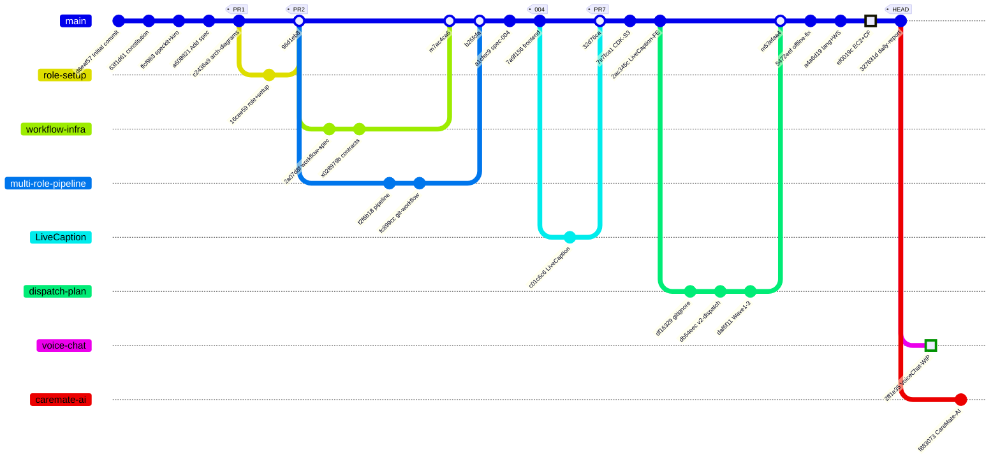
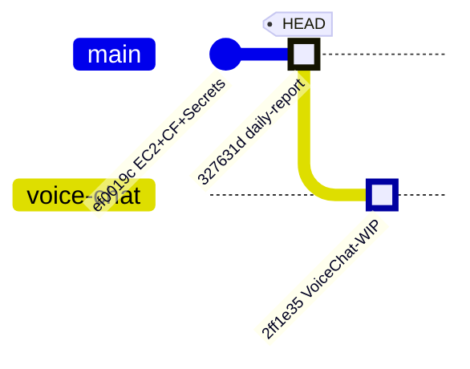
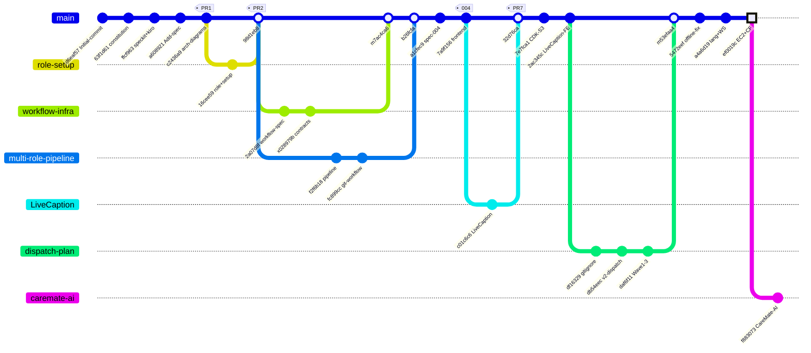

# Profit-Prophet

AI 驅動的照護人員語音助理。照護人員用中文語音或文字提問，系統從照護知識庫檢索並回答，同時自動分類 Care Event。

> **目前版本**：v2 — 24 小時 MVP，無後端運算層（前端直呼 AWS 服務）

**Branch**: `master` | **Started**: 2026-08-01 | **Last updated**: 2026-08-02

## 架構圖

🔗 [Profit-Prophet Architecture (Miro)](https://miro.com/app/board/uXjVKGfJMCY=/)

Board 上包含 v1（原設計）與 **v2（現行 24h MVP）** 兩組圖表：

- v2 整體系統架構（24h MVP / 無 Lambda）
- v2 資料流程圖（前端直呼 AWS）
- v2 Care Event 分類（合併至單一 Bedrock 呼叫）

完整架構說明、IAM 權限範圍與 24 小時排程請見 [docs/architecture.md](docs/architecture.md)。

## 技術棧

| 層級 | 服務 |
|------|------|
| Frontend | React + Vite + TypeScript, AWS SDK for JavaScript v3 |
| Backend | EC2 (Node.js) + CloudFront routing |
| Auth | Amazon Cognito Identity Pool（最小權限 IAM） |
| 語音辨識 | Amazon Transcribe Streaming (zh-TW) |
| 問答 + 分類 | Amazon Bedrock Knowledge Bases + Claude Haiku 4.5 |
| 語音合成 | Amazon Polly (Zhiyu, Neural) |
| 向量庫 | Amazon S3 Vectors |
| 資料 | Amazon S3, Amazon DynamoDB |
| Secrets | AWS Secrets Manager |
| IaC | AWS CDK (TypeScript) |
| Monitoring | CloudWatch, SNS |

## Git Commit Graph



## Project Structure

```
profit-prophet/
├── frontend/
│   ├── src/
│   │   ├── App.tsx                  # 主路由
│   │   ├── api/conversations.ts     # API 層
│   │   ├── components/              # UI 元件
│   │   │   ├── ChatBubble.tsx
│   │   │   ├── ChatHistory.tsx
│   │   │   ├── ErrorBoundary.tsx
│   │   │   ├── RecordCard.tsx
│   │   │   ├── RecordFilters.tsx
│   │   │   ├── Skeleton.tsx
│   │   │   └── VoiceButton.tsx
│   │   ├── pages/
│   │   │   ├── ChatPage.tsx
│   │   │   └── CaregiverDashboardPage.tsx
│   │   ├── lib/                     # Hooks + utilities
│   │   │   ├── useConversation.ts
│   │   │   ├── useCareRecords.ts
│   │   │   └── formatTime.ts
│   │   └── types/
│   │       ├── care.ts
│   │       └── conversation.ts
│   ├── vitest.config.ts
│   └── package.json
├── cdk/                             # AWS CDK infrastructure
├── docs/
│   ├── architecture.md
│   ├── dispatch-v2-plan.md
│   └── contracts/                   # Task Contracts (YAML)
├── specs/
│   └── 004-voice-chat-care-record/
├── .kiro/
│   ├── agents/                      # Custom Agents
│   ├── powers/                      # Powers (keyword-triggered)
│   ├── steering/                    # Steering Files
│   ├── skills/                      # Skills
│   │   └── daily-report/            # 日報生成器
│   └── specs/                       # Feature Specs
├── .specify/                        # Speckit configuration
├── .github/
│   └── workflows/
│       └── frontend-ci.yml          # CI pipeline
└── README.md
```

## 與 v1 的主要差異

- 移除 API Gateway + Lambda：前端透過 Cognito 臨時憑證直接呼叫 AWS 服務
- OpenSearch Serverless → **S3 Vectors**：成本降約 90%，無 collection 需管理
- Claude 3 Sonnet → **Claude Haiku 4.5**
- 移除 Amazon Comprehend：Care Event 分類併入 Bedrock 的 structured output
- 自建 RAG → **Bedrock Knowledge Bases** `RetrieveAndGenerate` 單一 API
- 新增 EC2 backend + CloudFront routing（`ef0019c`）

## Speckit Workflow

本專案使用 [speckit](https://github.com/speckit) 進行 AI 輔助規格與實作管理。

| Command | Description |
|---------|-------------|
| `speckit.specify` | 建立或更新 feature spec |
| `speckit.plan` | 生成實作計畫 |
| `speckit.tasks` | 生成依賴排序的任務清單 |
| `speckit.implement` | 執行任務 |
| `speckit.analyze` | 跨 artifact 一致性檢查 |
| `speckit.checklist` | 需求品質檢查清單 |
| `speckit.daily-report` | 生成每日進度報告 |
| `speckit.git.feature` | 建立 feature branch（sequential numbering） |

Spec source of truth: `specs/` + `.kiro/specs/`

## Development History

| Date | Milestone |
|------|-----------|
| 2026-08-01 09:30 | Initial commit, speckit + kiro 配置, constitution |
| 2026-08-01 10:00 | 001-create-role-setup：專案角色與 steering pack |
| 2026-08-01 11:00 | 002-github-workflow-infrastructure：workflow spec + contracts |
| 2026-08-01 13:00 | 003-multi-role-pipeline：多角色 pipeline 整合 git workflow |
| 2026-08-01 14:43 | 004-voice-chat-care-record：spec + frontend source code |
| 2026-08-01 15:37 | LiveCaption 分支合併 (PR #7) |
| 2026-08-01 16:47 | docs-v2-dispatch-plan：v2 架構 + 9 個 Task Contracts |
| 2026-08-01 17:37 | CDK S3 stack + LiveCaption 整合至 frontend |
| 2026-08-01 18:47 | Offline notice fix + 語言選項精簡 + WebSocket |
| 2026-08-01 21:15 | **EC2 backend + CloudFront routing + Secrets Manager** |
| 2026-08-02 08:56 | 005-voice-chat-care-record：本地開發保存至新分支 |
| 2026-08-02 09:20 | Add daily-report skill |

### Speckit Command Execution Log

| Date | Agent | Command | 說明 |
|------|-------|---------|------|
| 08-01 | kiro | `speckit.specify` | 初始化 Profit-Prophet spec + constitution |
| 08-01 | kiro | `speckit.git.feature` | 001, 002, 003 分支建立 |
| 08-01 | kiro | `speckit.implement` | 多角色 pipeline steering pack 實作 |
| 08-01 | kiro | `speckit.specify` | 004-voice-chat-care-record spec 建立 |
| 08-01 | kiro | `speckit.tasks` | github-workflow-infrastructure tasks 生成 |
| 08-02 | kiro | `speckit.git.feature` | 005-voice-chat-care-record 分支建立 |
| 08-02 | kiro | `speckit.daily-report` | 生成 2026-08-02 每日進度報告 |

## 📅 Daily Report (2026-08-02)

### ✅ 今日進度 (Done)

- [`327631d`] Add daily-report skill
- [`2ff1e35`] Voice chat care record — WIP 保存至 005 分支

**變更統計**: 35 files changed, +3,434 insertions, -627 deletions



### 🚧 進行中 (Doing)

- `005-voice-chat-care-record` — 語音聊天 + 照護紀錄前端元件
- `caremate-ai-integration` — CareMate AI 整合

### 🛑 Blockers

- 無

### ⏭️ 明日計畫

- 接續 005 分支，對接 EC2 backend (CloudFront + Secrets Manager)
- Frontend 元件測試覆蓋率 ≥ 80%
- 確認 CI workflow 運行結果

---

## 📅 Daily Report (2026-08-01)

### ✅ 今日進度 (Done)

**上午 — 專案初始化 + 多角色 Pipeline (09:30–13:00)**
- [`d6eaf57`] Initial commit from Specify template
- [`63f1d61`] docs: add hackathon environment constitution
- [`ffcf963`] chore: add speckit and kiro configuration files
- [`c2436a9`] [Spec Kit] Add architecture diagrams (PR #1)
- [`16cee59`] [Spec Kit] Add project role and setup files (PR #2)
- [`2a07d8f`] [Spec Kit] Add github-workflow-infrastructure specification
- [`f2f6b18`] [Spec Kit] Implement multi-role pipeline steering pack (PR #5)
- [`fc899cc`] [feat] Integrate original git workflow into multi-role pipeline (PR #6)

**下午 — 前端開發 + v2 規劃 (14:00–18:00)**
- [`a1cfec9`] [feat] Add spec for voice chat and care record feature
- [`7a9f156`] [feat] Add frontend source code — chat UI, care record, voice input
- [`c01c6c6`] LiveCaption (PR #7)
- [`7e7fca1`] [feat] Add CDK stack for S3 static website deployment
- [`2ac345c`] [feat] Integrate LiveCaption into frontend
- [`db54eec`] [docs] Add v2 dispatch plan and Wave 0 task contracts
- [`daf6f11`] [docs] Add Wave 1-3 task contracts (TASK-005 to TASK-009)
- [`5472eef`] [fix] Show offline notice on LiveCaption page
- [`a4a6d19`] feat: 語言選項只保留中英文，Transcribe 連線統一走 backend WebSocket

**晚上 — EC2 Backend (21:00)**
- [`ef0019c`] **[feat] EC2 backend + CloudFront routing + Secrets Manager integration**
- [`f883073`] feat: 整合 CareMate AI 智慧長照陪伴系統

**變更統計**: 33 commits, ~150 files changed, ~40,000+ insertions



### 🚧 進行中 (Doing)

- `004-voice-chat-care-record` — 前端元件開發中
- `caremate-ai-integration` — CareMate AI 整合
- v2 dispatch plan — 9 個 Task Contracts 已定義

### 🛑 Blockers

- 無

📁 完整日報檔案：[reports/daily-2026-08-01.md](reports/daily-2026-08-01.md) | [reports/daily-2026-08-02.md](reports/daily-2026-08-02.md)

## ⚠️ 安全性限制

此架構無後端層，因此**無法做 rate limiting 或伺服器端輸入驗證**。IAM policy 的資源範圍是唯一防線，存在 Bedrock 成本被濫用的風險。

**適用於 PoC / Demo / 內部驗證。上生產前需補回一層後端**（Lambda 或 Bedrock AgentCore）處理配額、驗證與稽核。詳見 [docs/architecture.md](docs/architecture.md#安全性限制重要)。

## GitHub Actions & Security

### CI Pipeline (`.github/workflows/frontend-ci.yml`)
- 每次 `push` / `pull_request` 自動執行：
  - `npm ci` 安裝依賴
  - `vitest` 單元測試
  - `tsc --noEmit` 型別檢查
  - `npm run build` 構建驗證

### 安全性建議
- **Branch Protection**: `master` 分支需 PR + status check pass
- **Secrets**: 使用 AWS Secrets Manager，禁止 hardcode
- `.env` 已加入 `.gitignore`

## Environment Variables

| Variable | Required | Description |
|----------|----------|-------------|
| `AWS_REGION` | Yes | AWS region (us-east-1 / us-west-2) |
| `COGNITO_IDENTITY_POOL_ID` | Yes | Cognito Identity Pool |
| `BEDROCK_KB_ID` | Yes | Bedrock Knowledge Base ID |
| `S3_VECTORS_BUCKET` | Yes | S3 Vectors bucket name |

> Never commit `.env` — it is git-ignored.
