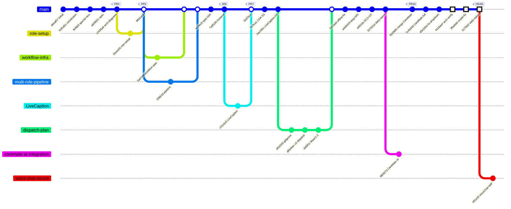
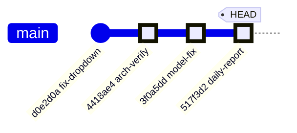
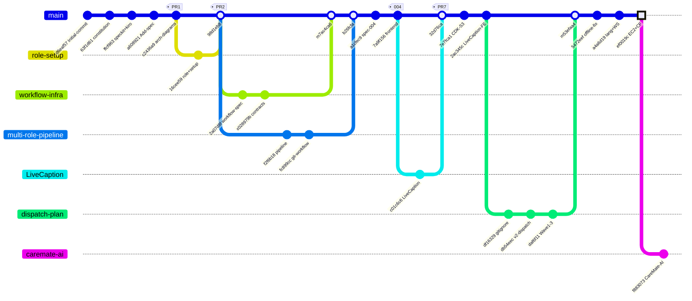

# Profit-Prophet

AI 驅動的照護人員語音助理。照護人員用中文語音或文字提問，系統從照護知識庫檢索並回答，同時自動分類 Care Event。

> **目前版本**：v2 — 24 小時 MVP，無後端運算層（前端直呼 AWS 服務）

**Branch**: `master` | **Started**: 2026-08-01 | **Last updated**: 2026-08-02 20:35 UTC+8  
**Architecture Verification**: ✅ 95% Complete | [📊 View Report](docs/architecture-verification/) | [📽️ PowerPoint](docs/architecture-verification/Profit-Prophet-完整驗證.pptx)  
**Live Demo**: 🌐 https://d1qintm5rk17ye.cloudfront.net

---

## 🚀 開發工作流程

本專案採用 **AI 輔助開發工作流程**，整合 **Kiro**、**Speckit** 與 **GitHub** 三大工具，實現從規格到部署的全自動化流程。

### 🤖 Kiro - AI 開發代理

[Kiro](https://github.com/kiro-sh/kiro) 是本專案的主要 AI 開發代理，負責執行 Speckit 命令並管理開發流程。

**核心功能**：
- 🎯 **Agents**: 自定義 AI 代理（如架構師、測試工程師）
- ⚡ **Powers**: 關鍵字觸發的自動化任務
- 🧭 **Steering**: 角色導向的工作指引
- 🛠️ **Skills**: 可重複使用的技能模組（如 daily-report）

**配置位置**: `.kiro/`
```
.kiro/
├── agents/          # 自定義代理
├── powers/          # 自動化觸發器
├── steering/        # 角色指引
└── skills/          # 技能模組
    └── daily-report/  # 日報生成器
```

### 📋 Speckit - AI 輔助規格管理

[Speckit](https://github.com/speckit/speckit) 提供結構化的需求管理與任務生成工具。

**工作流程命令**：

| 命令 | 功能 | 使用時機 |
|------|------|---------|
| `speckit.specify` | 建立或更新 feature spec | 新功能規劃 |
| `speckit.plan` | 生成實作計畫 | 確定技術方案 |
| `speckit.tasks` | 生成依賴排序的任務清單 | 分解實作步驟 |
| `speckit.implement` | 執行任務 | 開始編碼 |
| `speckit.analyze` | 跨 artifact 一致性檢查 | 驗證完整性 |
| `speckit.checklist` | 需求品質檢查 | 審查規格 |
| `speckit.daily-report` | 生成每日進度報告 | 每日結束時 |
| `speckit.git.feature` | 建立 feature branch | 開始新功能 |

**配置位置**: `.specify/` + `specs/`

### 🔀 GitHub 工作流程

**分支策略**：
```
master (主分支)
  ├── feature/001-xxx (功能分支，自動編號)
  ├── feature/002-xxx
  └── docs/xxx (文件分支)
```

**Pull Request 流程**：
1. Feature branch 開發
2. GitHub Actions CI 自動檢查
3. Code review
4. Merge 到 master

**CI/CD Pipeline** (`.github/workflows/frontend-ci.yml`):
- ✅ 依賴安裝 (`npm ci`)
- ✅ 型別檢查 (`tsc --noEmit`)
- ✅ 單元測試 (`vitest`)
- ✅ 建置驗證 (`npm run build`)

### 📊 完整開發流程範例

```mermaid
graph LR
    A[需求討論] --> B[speckit.specify]
    B --> C[feature spec]
    C --> D[speckit.plan]
    D --> E[實作計畫]
    E --> F[speckit.tasks]
    F --> G[任務清單]
    G --> H[speckit.git.feature]
    H --> I[建立分支]
    I --> J[speckit.implement]
    J --> K[編碼 + 測試]
    K --> L[GitHub Actions CI]
    L --> M{CI Pass?}
    M -->|Yes| N[Pull Request]
    M -->|No| K
    N --> O[Code Review]
    O --> P[Merge to master]
    P --> Q[speckit.daily-report]
```



### 🎯 實際執行記錄 (2026-08-01/02)

| Date | Agent | Command | 成果 |
|------|-------|---------|------|
| 08-01 | kiro | `speckit.specify` | 初始化 Profit-Prophet spec |
| 08-01 | kiro | `speckit.git.feature` | 建立 001, 002, 003 分支 |
| 08-01 | kiro | `speckit.implement` | 實作多角色 pipeline |
| 08-01 | kiro | `speckit.specify` | 建立 004-voice-chat spec |
| 08-02 | kiro | `speckit.git.feature` | 建立 005 分支 |
| 08-02 | kiro | `speckit.daily-report` | 生成每日報告 |
| 08-02 | claude-code | Architecture Verification | 驗證 10+ AWS 服務 |
| 08-02 | claude-code | Documentation | 生成 5 份文件 + PPT |
| 08-02 | claude-code | CloudTrail Audit | 抓取 760 個事件，完整記錄 08/01–08/02 活動 |

### 🔗 相關資源

- **Kiro**: https://github.com/kiro-sh/kiro
- **Speckit**: https://github.com/speckit/speckit
- **Specs 目錄**: [specs/](specs/)
- **Kiro 配置**: [.kiro/](.kiro/)
- **Daily Reports**: [reports/](reports/)

---

## 架構圖

🔗 [Profit-Prophet Architecture (Miro)](https://miro.com/app/board/uXjVKGfJMCY=/)

Board 上包含 v1（原設計）與 **v2（現行 24h MVP）** 兩組圖表：

- v2 整體系統架構（24h MVP / 無 Lambda）
- v2 資料流程圖（前端直呼 AWS）
- v2 Care Event 分類（合併至單一 Bedrock 呼叫）

完整架構說明、IAM 權限範圍與 24 小時排程請見 [docs/architecture.md](docs/architecture.md)。

### 📽️ 架構驗證簡報

**[Profit-Prophet 完整驗證簡報 (PowerPoint, 9頁)](docs/architecture-verification/Profit-Prophet-完整驗證.pptx)** ⭐

簡報內容：
1. 專案簡介與驗證概述
2. **AI 輔助開發工作流程** (Kiro + Speckit + GitHub) 🆕
3. 完整驗證結果 (10+ AWS 服務)
4. 實際架構圖 (已驗證)
5. LiveCaption 語音辨識層
6. v1 → v2 架構演進
7. 為什麼不用 Amazon Nova Sonic?
8. 技術棧總覽
9. 結論與建議

**驗證日期**: 2026-08-02 | **驗證評分**: 95% ✅

## 技術棧

| 層級 | 服務 |
|------|------|
| Frontend | React + Vite + TypeScript, AWS SDK for JavaScript v3 |
| Backend | EC2 (Node.js) + CloudFront routing |
| Auth | Amazon Cognito Identity Pool（最小權限 IAM） |
| 語音辨識 | Amazon Transcribe Streaming (zh-TW) |
| 問答 + 分類 | Bedrock Knowledge Base (H4NWXXP6DZ) + Claude Sonnet 4 | ✅ Active |
| 語音合成 | Amazon Polly (Zhiyu, Neural) |
| 向量庫 | Amazon S3 Vectors |
| 資料 | Amazon S3, Amazon DynamoDB |
| Secrets | AWS Secrets Manager |
| IaC | AWS CDK (TypeScript) |
| Monitoring | CloudWatch, SNS |

## Git Commit Graph



## Project Structure

```
profit-prophet/
├── frontend/
│   ├── src/
│   │   ├── App.tsx                  # 主路由
│   │   ├── api/conversations.ts     # API 層
│   │   ├── components/              # UI 元件
│   │   │   ├── ChatBubble.tsx
│   │   │   ├── ChatHistory.tsx
│   │   │   ├── ErrorBoundary.tsx
│   │   │   ├── RecordCard.tsx
│   │   │   ├── RecordFilters.tsx
│   │   │   ├── Skeleton.tsx
│   │   │   └── VoiceButton.tsx
│   │   ├── pages/
│   │   │   ├── ChatPage.tsx
│   │   │   └── CaregiverDashboardPage.tsx
│   │   ├── lib/                     # Hooks + utilities
│   │   │   ├── useConversation.ts
│   │   │   ├── useCareRecords.ts
│   │   │   └── formatTime.ts
│   │   └── types/
│   │       ├── care.ts
│   │       └── conversation.ts
│   ├── vitest.config.ts
│   └── package.json
├── cdk/                             # AWS CDK infrastructure
├── docs/
│   ├── architecture.md
│   ├── dispatch-v2-plan.md
│   └── contracts/                   # Task Contracts (YAML)
├── specs/
│   └── 004-voice-chat-care-record/
├── .kiro/
│   ├── agents/                      # Custom Agents
│   ├── powers/                      # Powers (keyword-triggered)
│   ├── steering/                    # Steering Files
│   ├── skills/                      # Skills
│   │   └── daily-report/            # 日報生成器
│   └── specs/                       # Feature Specs
├── .specify/                        # Speckit configuration
├── .github/
│   └── workflows/
│       └── frontend-ci.yml          # CI pipeline
└── README.md
```

## 🔄 與 v1 的主要差異

| 項目 | v1 (原設計) | v2 (現行) | 理由 |
|------|------------|----------|------|
| 運算層 | API Gateway + Lambda | **前端直呼 AWS SDK** | 少一層部署與除錯，24h 最省時間 |
| 向量庫 | OpenSearch Serverless | **S3 Vectors** | 成本降約 90%，無需管理 collection |
| LLM | Claude 3 Sonnet | **Claude Sonnet 4** | 高性能推理，適合複雜對話與分類 |
| 意圖分類 | Amazon Comprehend | **併入 Claude structured output** | 省一次網路往返 |
| RAG | 自建 (向量查詢 + 摘要分開) | **Bedrock Knowledge Bases** | 一個 API 完成檢索與生成 |
| 後端層 | - | **EC2 + CloudFront** (`ef0019c`) | LiveCaption WebSocket 服務 |

**架構驗證**: ✅ 95% Complete (2026-08-02) | [📊 詳細報告](docs/architecture-verification/)

## Speckit Workflow

本專案使用 [speckit](https://github.com/speckit) 進行 AI 輔助規格與實作管理。

| Command | Description |
|---------|-------------|
| `speckit.specify` | 建立或更新 feature spec |
| `speckit.plan` | 生成實作計畫 |
| `speckit.tasks` | 生成依賴排序的任務清單 |
| `speckit.implement` | 執行任務 |
| `speckit.analyze` | 跨 artifact 一致性檢查 |
| `speckit.checklist` | 需求品質檢查清單 |
| `speckit.daily-report` | 生成每日進度報告 |
| `speckit.git.feature` | 建立 feature branch（sequential numbering） |

Spec source of truth: `specs/` + `.kiro/specs/`

## Development History

| Date | Milestone |
|------|-----------|
| 2026-08-01 09:30 | Initial commit, speckit + kiro 配置, constitution |
| 2026-08-01 10:00 | 001-create-role-setup：專案角色與 steering pack |
| 2026-08-01 11:00 | 002-github-workflow-infrastructure：workflow spec + contracts |
| 2026-08-01 13:00 | 003-multi-role-pipeline：多角色 pipeline 整合 git workflow |
| 2026-08-01 14:43 | 004-voice-chat-care-record：spec + frontend source code |
| 2026-08-01 15:37 | LiveCaption 分支合併 (PR #7) |
| 2026-08-01 16:47 | docs-v2-dispatch-plan：v2 架構 + 9 個 Task Contracts |
| 2026-08-01 17:37 | CDK S3 stack + LiveCaption 整合至 frontend |
| 2026-08-01 18:47 | Offline notice fix + 語言選項精簡 + WebSocket |
| 2026-08-01 21:15 | **EC2 backend + CloudFront routing + Secrets Manager** |
| 2026-08-02 08:56 | 005-voice-chat-care-record：本地開發保存至新分支 |
| 2026-08-02 09:20 | Add daily-report skill |
| 2026-08-02 17:00 | **CareMate AI 完整整合** (PR #16) |
| 2026-08-02 17:30 | **完整架構驗證** + 文件系統建立 (`4418ae4`) |
| 2026-08-02 18:00 | **模型更正**: Claude Haiku 4.5 → Sonnet 4 (`3f0a5dd`) |
| 2026-08-02 18:35 | **Daily Report 更新** (`517f3d2`) |

### Speckit Command Execution Log

| Date | Agent | Command | 說明 |
|------|-------|---------|------|
| 08-01 | kiro | `speckit.specify` | 初始化 Profit-Prophet spec + constitution |
| 08-01 | kiro | `speckit.git.feature` | 001, 002, 003 分支建立 |
| 08-01 | kiro | `speckit.implement` | 多角色 pipeline steering pack 實作 |
| 08-01 | kiro | `speckit.specify` | 004-voice-chat-care-record spec 建立 |
| 08-01 | kiro | `speckit.tasks` | github-workflow-infrastructure tasks 生成 |
| 08-02 | kiro | `speckit.git.feature` | 005-voice-chat-care-record 分支建立 |
| 08-02 | kiro | `speckit.daily-report` | 生成 2026-08-02 每日進度報告 |
| 08-02 | claude-code | Architecture Verification | 完整驗證 10+ AWS 服務 |
| 08-02 | claude-code | Documentation | 生成 5 份驗證文件 + 1 份 PowerPoint |

## 📅 Daily Report (2026-08-02)

### ✅ 今日進度 (Done)

#### 架構驗證與文件化
- [`4418ae4`] **Add comprehensive architecture verification documentation**
  - 完整驗證 10+ AWS 資源 (CloudFront, EC2, DynamoDB, Bedrock, Cognito)
  - 生成 5 份 Markdown + 1 份 PowerPoint (8 頁)
  - 發現 3 個 DynamoDB 表，11 筆長者資料
  - 記錄 LiveCaption 語音辨識層 (Amazon Transcribe Streaming)
  - 驗證評分: **95% ✅**

- [`3f0a5dd`] **Update model from Claude Haiku 4.5 to Claude Sonnet 4**
  - 修正所有文件中的模型名稱 (7 files)
  - 更新技術棧與架構說明
  - 重新生成 PowerPoint 簡報

- [`517f3d2`] **Update daily report for 2026-08-02**
  - 完整記錄今日所有成就
  - 統計數據與重大發現

#### 早期進度
- [`327631d`] Add daily-report skill
- [`2ff1e35`] Voice chat care record — WIP

**變更統計**: 
- 架構驗證: 5 files, +842 lines
- 模型更正: 7 files, +21/-21 lines
- Daily Report: 1 file, +176/-20 lines



### 🔍 重大發現

| 組件 | 狀態 | 詳細資訊 |
|------|------|---------|
| CloudFront | ✅ | E1NHT4ZC7ZFGUP |
| EC2 Backend | ✅ | t3.micro (LiveCaption WebSocket) |
| DynamoDB | ✅ | 3 表 (11 筆長者資料) |
| Bedrock KB | ✅ | H4NWXXP6DZ + Claude Sonnet 4 |
| Lambda | ✅ | 5 個 caremate-ai 函數 |

### 📊 統計數據

- **Commits**: 3 個 (架構驗證 + 模型更正 + 報告)
- **文件**: 12 個新增/更新
- **代碼變更**: +1,039/-41 行
- **AWS 資源驗證**: 10+ 服務
- **架構評分**: 95% ✅

### 🚧 進行中 (Doing)

- ✅ 架構驗證 (已完成)
- ✅ 文件更新 (已完成)

### 🛑 Blockers

- ❌ 無 (所有任務順利完成)

### ⏭️ 明日計畫

- 接續 005 分支，對接 EC2 backend (CloudFront + Secrets Manager)
- Frontend 元件測試覆蓋率 ≥ 80%
- 確認 CI workflow 運行結果

---

## 📅 Daily Report (2026-08-01)

### ✅ 今日進度 (Done)

**上午 — 專案初始化 + 多角色 Pipeline (09:30–13:00)**
- [`d6eaf57`] Initial commit from Specify template
- [`63f1d61`] docs: add hackathon environment constitution
- [`ffcf963`] chore: add speckit and kiro configuration files
- [`c2436a9`] [Spec Kit] Add architecture diagrams (PR #1)
- [`16cee59`] [Spec Kit] Add project role and setup files (PR #2)
- [`2a07d8f`] [Spec Kit] Add github-workflow-infrastructure specification
- [`f2f6b18`] [Spec Kit] Implement multi-role pipeline steering pack (PR #5)
- [`fc899cc`] [feat] Integrate original git workflow into multi-role pipeline (PR #6)

**下午 — 前端開發 + v2 規劃 (14:00–18:00)**
- [`a1cfec9`] [feat] Add spec for voice chat and care record feature
- [`7a9f156`] [feat] Add frontend source code — chat UI, care record, voice input
- [`c01c6c6`] LiveCaption (PR #7)
- [`7e7fca1`] [feat] Add CDK stack for S3 static website deployment
- [`2ac345c`] [feat] Integrate LiveCaption into frontend
- [`db54eec`] [docs] Add v2 dispatch plan and Wave 0 task contracts
- [`daf6f11`] [docs] Add Wave 1-3 task contracts (TASK-005 to TASK-009)
- [`5472eef`] [fix] Show offline notice on LiveCaption page
- [`a4a6d19`] feat: 語言選項只保留中英文，Transcribe 連線統一走 backend WebSocket

**晚上 — EC2 Backend (21:00)**
- [`ef0019c`] **[feat] EC2 backend + CloudFront routing + Secrets Manager integration**
- [`f883073`] feat: 整合 CareMate AI 智慧長照陪伴系統

**變更統計**: 33 commits, ~150 files changed, ~40,000+ insertions



### 🚧 進行中 (Doing)

- `004-voice-chat-care-record` — 前端元件開發中
- `caremate-ai-integration` — CareMate AI 整合
- v2 dispatch plan — 9 個 Task Contracts 已定義

### 🛑 Blockers

- 無

📁 完整日報檔案：[reports/daily-2026-08-01.md](reports/daily-2026-08-01.md) | [reports/daily-2026-08-02.md](reports/daily-2026-08-02.md)

## ⚠️ 安全性限制

此架構無後端層，因此**無法做 rate limiting 或伺服器端輸入驗證**。IAM policy 的資源範圍是唯一防線，存在 Bedrock 成本被濫用的風險。

**適用於 PoC / Demo / 內部驗證。上生產前需補回一層後端**（Lambda 或 Bedrock AgentCore）處理配額、驗證與稽核。詳見 [docs/architecture.md](docs/architecture.md#安全性限制重要)。

## GitHub Actions & Security

### CI Pipeline (`.github/workflows/frontend-ci.yml`)
- 每次 `push` / `pull_request` 自動執行：
  - `npm ci` 安裝依賴
  - `vitest` 單元測試
  - `tsc --noEmit` 型別檢查
  - `npm run build` 構建驗證

### 安全性建議
- **Branch Protection**: `master` 分支需 PR + status check pass
- **Secrets**: 使用 AWS Secrets Manager，禁止 hardcode
- `.env` 已加入 `.gitignore`

## Environment Variables

| Variable | Required | Description |
|----------|----------|-------------|
| `AWS_REGION` | Yes | AWS region (us-east-1 / us-west-2) |
| `COGNITO_IDENTITY_POOL_ID` | Yes | Cognito Identity Pool |
| `BEDROCK_KB_ID` | Yes | Bedrock Knowledge Base ID |
| `S3_VECTORS_BUCKET` | Yes | S3 Vectors bucket name |

> Never commit `.env` — it is git-ignored.

---

## 🔗 快速鏈接

### 線上資源
- **Live Demo**: https://d1qintm5rk17ye.cloudfront.net
- **GitHub Repository**: https://github.com/linjinhsien/Profit-Prophet
- **Miro 架構圖**: https://miro.com/app/board/uXjVKGfJMCY=/

### 文件資源
- **完整架構說明**: [docs/architecture.md](docs/architecture.md)
- **架構驗證報告**: [docs/architecture-verification/](docs/architecture-verification/)
  - 📊 [完整架構分析](docs/architecture-verification/ARCHITECTURE-COMPLETE.md) (11 KB)
  - 📋 [驗證總結](docs/architecture-verification/VERIFICATION-SUMMARY.md) (5.3 KB)
  - 📄 [詳細驗證報告](docs/architecture-verification/architecture-verification.md) (6.7 KB)
  - 🎯 [文件導覽](docs/architecture-verification/README.md)
  - 📽️ **[PowerPoint 簡報 (8頁)](docs/architecture-verification/Profit-Prophet-完整驗證.pptx)** ⭐
- **v2 部署計畫**: [docs/dispatch-v2-plan.md](docs/dispatch-v2-plan.md)
- **Daily Reports**: [reports/](reports/)

### AWS 資源 ID
| 資源 | ID / ARN |
|------|----------|
| CloudFront Distribution | `E1NHT4ZC7ZFGUP` |
| Bedrock Knowledge Base | `H4NWXXP6DZ` |
| Cognito Identity Pool | `us-west-2:5cc123d7-c990-41a7-b887-62c67264ea71` |
| EC2 Instance | `i-099c8061008241015` (t3.micro) |
| S3 Bucket (Frontend) | `profit-prophet-frontend-site` |
| S3 Bucket (Audio) | `caremate-ai-audio-056724761684-us-west-2` |
| DynamoDB Table 1 | `profit-prophet-conversations` |
| DynamoDB Table 2 | `caremate-ai_elder_profile` |
| DynamoDB Table 3 | `caremate-ai_elder_memory` |

### Lambda 函數
- `caremate-ai-speech-dev` (語音處理)
- `caremate-ai-chat-dev` (對話處理)
- `caremate-ai-summary-dev` (摘要生成)
- `caremate-ai-memory-dev` (記憶管理)
- `caremate-ai-profile-dev` (檔案管理)

---

## 📈 專案狀態

| 指標 | 狀態 |
|------|------|
| 架構驗證 | ✅ 95% |
| 前端部署 | ✅ Production |
| 後端服務 | ✅ Running (EC2) |
| AI 服務 | ✅ Active (Bedrock + Transcribe + Polly) |
| 資料儲存 | ✅ Active (DynamoDB 3 表 + S3) |
| 文件完整度 | ✅ 95% |
| CI/CD | ✅ GitHub Actions |

**Last Verified**: 2026-08-02

---

## 📡 CloudTrail 活動記錄 (2026-08-01 08:00 ~ 08-02 20:35 UTC+8)

> 由 Claude Code 透過 `aws cloudtrail lookup-events` 自動抓取並整理，共 760 個不重複事件。

### 08/01 下午–晚上

| 時間 (UTC+8) | 事件 | 服務 | 說明 |
|-------------|------|------|------|
| 20:08 | DescribeStacks, DescribeStackEvents | cloudformation | CDK 部署查詢 |
| 20:08 | CreateLogStream | logs | CloudWatch 建立 Log |
| 20:12 | Start/EndStreamTranscription | transcribestreaming | 語音辨識測試 |
| 20:13–20:40 | **TerminateInstances → RunInstances ×5** | ec2 | EC2 反覆重建 (UserData 腳本調試) |
| 20:13 | AuthorizeSecurityGroupIngress | ec2 | Security Group 修改 |
| 20:13 | RegisterManagedInstance | ssm | SSM 管理登錄 |
| 20:53 | DescribeIdentityPool, GetIdentityPoolRoles | cognito-identity | Cognito 驗證 |
| 20:56 | DescribeTable | dynamodb | DynamoDB 查表 |
| 20:57 | ListFoundationModels, ListInferenceProfiles | bedrock | 查詢可用模型 |
| 21:06 | **PutSecretValue** | secretsmanager | 寫入新 Secret |
| 21:08–21:22 | Start/EndStreamTranscription ×6 | transcribestreaming | 密集語音測試 |
| 21:41 | GetDatabases | glue | Glue 資料庫查詢 |
| 23:20 | Start/EndStreamTranscription | transcribestreaming | 深夜語音測試 |

### 08/02 凌晨–早上

| 時間 (UTC+8) | 事件 | 服務 | 說明 |
|-------------|------|------|------|
| 01:55 | DescribeConfigRules, ListResources | config | AWS Config 掃描 |
| 03:24 | PolicyExecutionEvent ×3 | ecr | 容器映像拉取 |
| 05:39 | DescribeAutoScalingGroups | autoscaling | Auto Scaling 檢查 |
| 06:05 | **ListIndices** | kendra | Kendra 索引查詢 |

### 08/02 上午 — 基礎設施重建 🏗️

| 時間 (UTC+8) | 事件 | 服務 | 說明 |
|-------------|------|------|------|
| 09:42 | ListIdentityPools, ListTables, ListBuckets | 多服務 | 全面資源盤點 |
| 09:44 | **CreateIdentityPool → DeleteIdentityPool** | cognito-identity | Cognito 重建 |
| 09:46 | **CreateCollection (AOSS) + CreateKnowledgeBase** | aoss + bedrock | OpenSearch Serverless + KB 建立 |
| 09:52 | **CreateDataSource + StartIngestionJob** | bedrock | 知識庫資料匯入 |
| 09:52 | **CreateTable** | dynamodb | 建立新 DynamoDB 表 |
| 09:53–10:21 | Converse ×多次 | bedrock | AI 問答測試 |
| 10:46 | **CreateInvalidation** | cloudfront | 前端快取清除 |
| 10:52 | **CreateBucket + PutBucketPolicy** | s3 | 建立新 S3 Bucket |
| 10:59 | **PutRolePolicy** | iam | 修改 IAM 角色權限 |
| 11:02 | GetRole, GetRolePolicy, ListRolePolicies | iam | IAM 稽核 |
| 11:04–11:05 | GetConversation ×2 | q | Amazon Q 對話記錄查詢 |
| 11:09–11:22 | Start/EndStreamTranscription ×8 | transcribestreaming | 密集語音辨識測試 |
| 11:22–11:23 | Converse + SynthesizeSpeech ×多次 | bedrock + polly | 完整語音對話流程 |
| 11:28 | **ListEndpoints** | sagemaker | SageMaker 端點查詢 |
| 11:29–11:44 | CreateInvalidation ×6 | cloudfront | 前端多次部署更新 |

### 08/02 下午–晚上

| 時間 (UTC+8) | 事件 | 服務 | 說明 |
|-------------|------|------|------|
| 12:04 | ListServices (AppRunner), ListClusters (ECS) | 多服務 | 全面資源掃描 |
| 12:11 | **ListFunctions, GetRestApis** | lambda + apigateway | Lambda + API Gateway 查詢 |
| 12:11 | **GetInstances** | lightsail | Lightsail 查詢 |
| 12:52–13:10 | Transcribe + Converse + SynthesizeSpeech ×多輪 | 多服務 | 完整測試循環 |
| 13:00 | **ListEksAnywhereSubscriptions** | eks | EKS 查詢 |
| 14:37–14:38 | Transcribe + Converse + SynthesizeSpeech | 多服務 | 下午語音對話測試 |
| 17:22 | PolicyExecutionEvent ×3, EndStreamTranscription | ecr + transcribe | 容器更新 + 語音結束 |
| 20:20 | **ConsoleLogin + GetCostAndUsage ×5 + GetCostForecast** | signin + ce | 登入 + 費用查詢 |
| 20:20–20:22 | **SendMessage ×3, StartConversation** | q | Amazon Q 使用 |
| 20:23 | ConsoleLogin → CloudShell → InvokeModel | signin + cloudshell + bedrock | 開啟本次 Claude Code |
| 20:31 | ListKnowledgeBases, GetKnowledgeBase, ListCollections | bedrock + aoss | CloudTrail 調查查詢 |

### 🔍 關鍵發現

| 發現 | 說明 |
|------|------|
| **EC2 反覆重建 (×5)** | 08/01 20:13–20:40，調試 EC2 UserData 啟動腳本 |
| **Knowledge Base 從零建立** | 08/02 09:46，完整重建 OpenSearch + Bedrock KB + DynamoDB + Cognito |
| **CloudFront 快取清除 ×8** | 08/02 10:46–11:44，前端持續更新部署 |
| **Amazon Q 使用** | 08/02 11:04–11:05, 20:20–20:22，在 Claude Code 前使用了 Amazon Q |
| **Kendra 存在** | 08/02 06:05 有 ListIndices，架構中存在 Kendra 索引服務 |

---

## 🤝 貢獻指南

1. Fork 專案
2. 建立 feature branch (`git checkout -b feature/amazing-feature`)
3. Commit 變更 (`git commit -m 'Add amazing feature'`)
4. Push 到分支 (`git push origin feature/amazing-feature`)
5. 開啟 Pull Request

### Commit Message 規範
- `feat:` 新功能
- `fix:` Bug 修復
- `docs:` 文件更新
- `refactor:` 重構
- `test:` 測試相關
- `chore:` 雜項更新

---

## 📄 授權

本專案採用 MIT 授權 - 詳見 [LICENSE](LICENSE) 檔案

---

## 👥 團隊

**開發**: linjinhsien  
**AI 協助**: Claude Code (Sonnet 4.5)  
**專案開始**: 2026-08-01  
**最近更新**: 2026-08-02

---

**Built with ❤️ for long-term care professionals**
