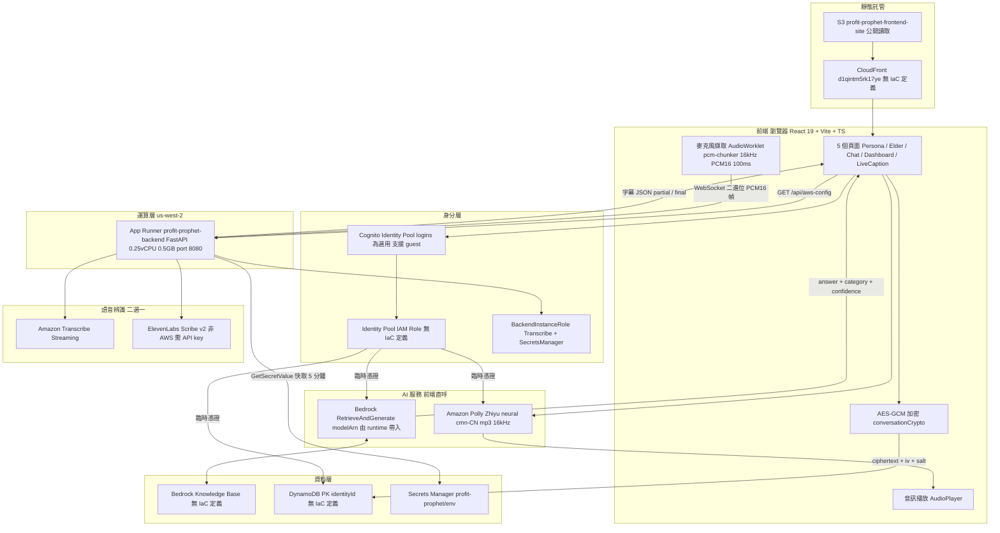
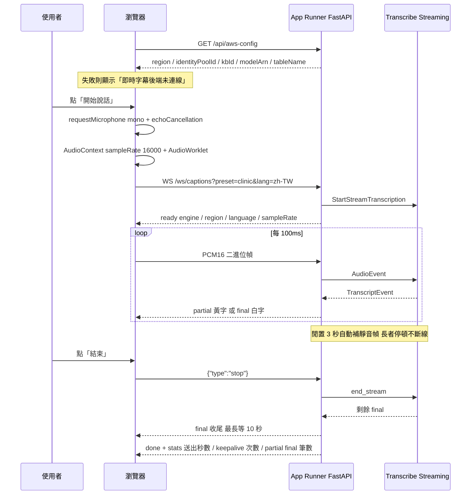
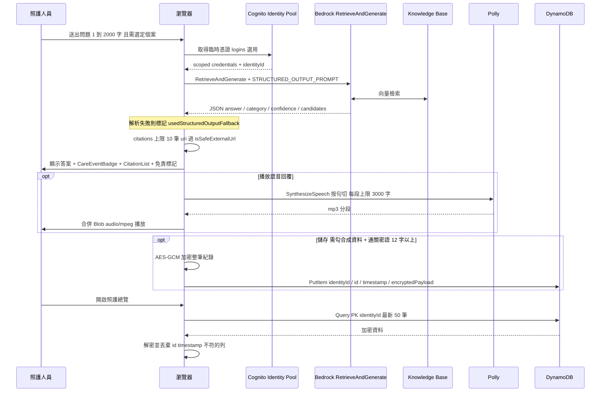
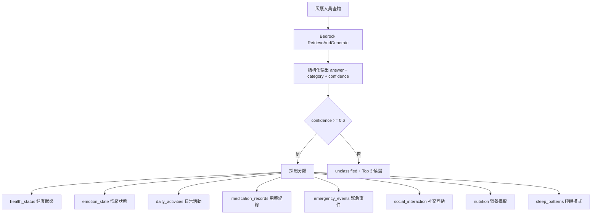
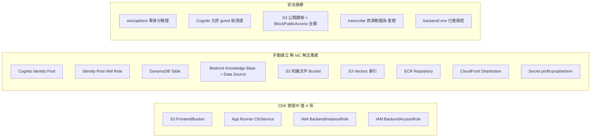

# Profit-Prophet 系統架構圖 — v3（程式碼實況）

> **版本**：v3 — 依 `master` 分支實際程式碼繪製，非設計提案
> **繪製日期**：2026-08-02
> **用途**：v1（board 上的原設計）與 v2（`docs/architecture.md`）都已與程式碼脫節，本文件是唯一與程式碼一致的架構描述

每個節點都對應到實際檔案。若圖與程式碼不符，以程式碼為準並回頭修這份文件。

---

## 與 v2 文件的三個關鍵差異

| 項目 | v2 文件寫的 | 程式碼實際做的 | 證據 |
|------|-----------|--------------|------|
| 運算層 | 無後端，前端直呼所有 AWS 服務 | **語音走後端**：FastAPI on App Runner 代呼 Transcribe | `LiveCaption/backend/app/main.py:160` `/ws/captions`；`frontend/src/lib/useVoiceInput.ts` |
| 語音辨識路徑 | 瀏覽器 → Transcribe（直呼） | 瀏覽器 → WebSocket → 後端 → Transcribe | `frontend/package.json` 沒有 `@aws-sdk/client-transcribe-streaming`；`frontend/src/api/transcribe.ts` 不存在 |
| Hosting | AWS Amplify Hosting | **S3 靜態網站**（CloudFront 存在但無 IaC） | `cdk/bin/frontend-stack.ts`；CloudFront 只以 CORS origin 字串出現於 `main.py:52` |

v2 的「無後端層 → 無法做 rate limiting」結論因此需要改寫：後端層已經存在，只是還沒在上面做配額與驗證。

---

## 圖 1：整體系統架構

**交付路徑**（不在上圖，避免混淆）：
`buildspec.yml` CodeBuild → `docker build`（`python:3.13-slim`）→ push ECR `056724761684.dkr.ecr.us-west-2.amazonaws.com/profit-prophet-backend:latest` → App Runner 手動部署（`autoDeploymentsEnabled: false`）。

---

## 圖 2：資料流

### 2a. 語音字幕流

### 2b. 問答與紀錄流

### 2c. Care Event 分類

分類與回答在**同一次** Bedrock 呼叫內完成，沒有 Comprehend。

---

## 圖 3：IaC 覆蓋率與安全旗標

### IaC 缺口明細

`cdk.json` 的 `app` 只指向 `bin/frontend-stack.ts`，所以直接跑 `cdk deploy` 只會部署前端；後端要顯式加 `--app`。兩個 stack 各自 `new cdk.App()`，沒有共用 App。

上表 9 項手動資源的 ID 與名稱只存在於 Secrets Manager 與 `backend/.env`，repo 內查不到。`scripts/check-infra.ps1` 是目前唯一的驗證手段。

### 安全旗標明細

| # | 問題 | 位置 | 衝突的規範 |
|---|------|------|-----------|
| R1 | WebSocket 端點無任何身分驗證，任何連得到的人都能消耗 AWS 額度 | `LiveCaption/backend/app/main.py:160`（docstring 自述） | SECURITY-RULES §2 所有 API 端點需認證 |
| R2 | `hasAuthenticatedCognitoLogin()` 無條件回 `true`，未帶 logins 即 guest 模式取得憑證 | `frontend/src/lib/credentials.ts` | SECURITY-RULES §2 |
| R3 | `publicReadAccess: true` 且四個 `BlockPublicAccess` 全設 `false`，但同檔註解寫「public read blocked per Constitution」 | `cdk/bin/frontend-stack.ts` | SECURITY-RULES §7 S3 預設封鎖公開存取 |
| R4 | `transcribe:StartStreamTranscription` 的 `resources: ['*']` | `cdk/bin/backend-stack.ts` | SECURITY-RULES §2 最小權限 |
| R5 | `LiveCaption/backend/.env` 已進版控 | repo | SECURITY-RULES §1 `.env` 不得 commit |

R1 與 R2 疊加的效果是：整條 AI 鏈路（Transcribe、Bedrock、Polly）對匿名使用者開放，沒有配額上限。

---

## 區域設定

| 位置 | 值 | 說明 |
|------|-----|------|
| `frontend/src/lib/config.ts` | 型別限 `us-east-1` \| `us-west-2` | 符合 Constitution |
| `LiveCaption/backend/app/config.py` | 預設 `ap-northeast-1` | Transcribe Streaming 無台北區域，就近選東京 |
| App Runner 環境變數 | `AWS_REGION=us-west-2` | 實際生效值，覆寫上面的預設 |

程式碼預設值（東京）與實際部署值（奧勒岡）不同。若有人在本機不帶環境變數跑後端，會連到東京，而 workshop 帳號的 `ws-default-policy` 明確拒絕東京。

---

## 語音辨識情境預設

| preset | 場景 | 語言 | 語者標籤 | 穩定度 | 實測字幕落後 |
|--------|------|------|---------|--------|-------------|
| `clinic` | 看診／衛教 | 固定 zh-TW | 關 | high | 0.17s |
| `caregiver` | 照服員與長者 | 自動辨識 | 開 | high | 0.44s |
| `elder` | 長者自己用 | 固定 zh-TW | 關 | medium | — |

語者標籤是最大的延遲來源（2.6 倍），不是字幕穩定化。量測方法與完整數據見 `LiveCaption/backend/README.md`。

---

## 對應檔案索引

| 圖上節點 | 檔案 |
|---------|------|
| 麥克風擷取 / WebSocket 客戶端 | `frontend/src/lib/useVoiceInput.ts`、`frontend/src/pages/LiveCaptionPage.tsx` |
| Bedrock 呼叫與結構化輸出解析 | `frontend/src/api/bedrock.ts` |
| Polly 合成與分段 | `frontend/src/api/polly.ts` |
| DynamoDB 讀寫與加密 | `frontend/src/api/conversations.ts`、`frontend/src/lib/conversationCrypto.ts` |
| Cognito 憑證 | `frontend/src/lib/credentials.ts` |
| Runtime 設定載入 | `frontend/src/lib/config.ts` |
| WebSocket 端點與 Secrets 橋接 | `LiveCaption/backend/app/main.py` |
| Transcribe 介面層 | `LiveCaption/backend/app/services/transcribe.py` |
| ElevenLabs 引擎 | `LiveCaption/backend/app/services/elevenlabs_stt.py` |
| 情境預設值 | `LiveCaption/backend/app/config.py` |
| App Runner + IAM | `cdk/bin/backend-stack.ts` |
| S3 靜態站 | `cdk/bin/frontend-stack.ts` |
| 容器交付 | `LiveCaption/backend/Dockerfile`、`LiveCaption/backend/buildspec.yml` |
