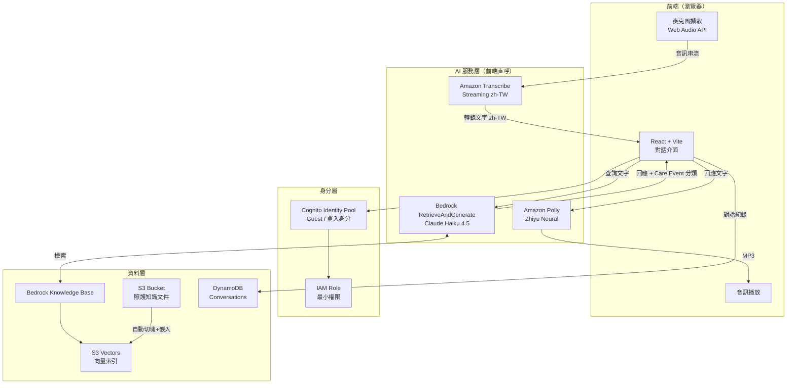
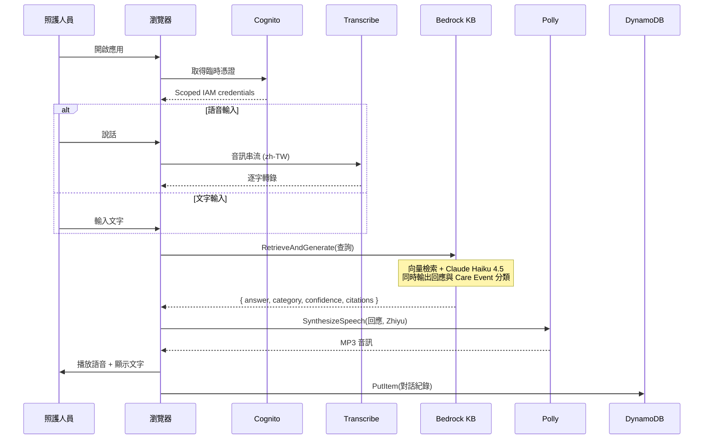

# Profit-Prophet 系統架構圖

> **版本**：v2 — 24 小時 MVP（無後端 Lambda）
> **設計原則**：最少服務數、最低固定成本、可在 24 小時內完成 Demo

## 架構決策摘要

| 項目 | v1（原設計） | v2（現行） | 理由 |
|------|-------------|-----------|------|
| 運算層 | API Gateway + Lambda | **無**（前端直呼 AWS SDK） | 少一層部署與除錯，24h 內最省時間 |
| 向量庫 | OpenSearch Serverless | **S3 Vectors** | 2025/12 GA，成本降約 90%，無需管理 collection |
| RAG | 自建（向量查詢 + 摘要分開） | **Bedrock Knowledge Bases** `RetrieveAndGenerate` | 一個 API 完成檢索與生成 |
| LLM | Claude 3 Sonnet | **Claude Haiku 4.5** | Claude 3 已過時；Haiku 4.5 低延遲低成本，適合對話 |
| 意圖分類 | Amazon Comprehend | **併入 Claude structured output** | 省一次網路往返與一個服務 |
| 語音 | Transcribe + Polly（經 Lambda） | **Transcribe + Polly（前端直呼）** | 保留中文語音，但移除中介層 |
| 憑證 | API Key | **Cognito Identity Pool + 最小權限 IAM** | 前端直呼 AWS 服務的唯一安全做法 |

### 為什麼不用 Nova Sonic

Amazon Nova 2 Sonic 是 speech-to-speech 模型，一個模型即可取代 Transcribe + Comprehend + Claude + Polly，是最理想的簡化路線。但它目前僅支援英語、西班牙語、法語、義大利語、德語、葡萄牙語、印地語，**不支援中文**，因此本專案仍維持 Transcribe + Polly 的組合。

參考：[Amazon Nova speech models](https://aws.amazon.com/ai/generative-ai/nova/speech/)（內容已改寫以符合授權規範）

---

## 整體系統架構

## 資料流程圖

## Care Event 分類

分類不再由獨立服務處理，而是在同一次 Bedrock 呼叫中以 structured output 產生。

## IAM 最小權限範圍

Cognito Identity Pool 綁定的 role 僅允許下列動作，範圍鎖定到特定資源：

| 動作 | 資源範圍 |
|------|---------|
| `transcribe:StartStreamTranscription` | — |
| `polly:SynthesizeSpeech` | — |
| `bedrock:RetrieveAndGenerate` | 指定 Knowledge Base ID |
| `bedrock:InvokeModel` | 僅 Claude Haiku 4.5 inference profile |
| `dynamodb:PutItem` / `Query` | 指定 table，並以 `dynamodb:LeadingKeys` 限制為呼叫者自己的 Cognito identity ID |

## 24 小時實作排程

| 時段 | 工作項目 | 產出 |
|------|---------|------|
| 0–2h | Cognito Identity Pool + IAM role | 前端可取得臨時憑證 |
| 2–4h | S3 上傳文件 → Bedrock KB（S3 Vectors）建立並同步 | KB 可在 Console 測試檢索 |
| 4–7h | Vite + React 骨架，打通 `RetrieveAndGenerate` | 文字問答可用 |
| 7–11h | Transcribe Streaming 接麥克風（zh-TW） | 語音轉文字可用 |
| 11–13h | Polly 回應播放（Zhiyu Neural） | 語音回覆可用 |
| 13–16h | Care Event structured output + UI 標籤顯示 | 分類結果可見 |
| 16–18h | DynamoDB 對話紀錄直寫 | 歷史紀錄可查 |
| 18–21h | UI 收尾、錯誤處理、載入狀態 | 可展示品質 |
| 21–24h | Demo 演練 + 緩衝 | — |

**風險項**：Transcribe 中文串流準確度需在 7–11h 區間盡早實測，若不理想則退回純文字輸入（已在 4–7h 完成，可獨立運作）。

## 安全性限制（重要）

此架構沒有後端層，因此：

- **無法做 rate limiting**：任何取得 Cognito 憑證的人都可呼叫 Bedrock，存在成本濫用風險
- **無法做伺服器端輸入驗證**：prompt injection 只能靠模型端防護
- **憑證範圍是唯一防線**：IAM policy 必須嚴格鎖定資源，不可用 wildcard

**適用範圍**：PoC / Demo / 內部驗證。若要上生產，需補回一層後端（Lambda 或 AgentCore）處理配額、驗證與稽核。

## 技術棧

- **Frontend**: React + Vite + TypeScript, AWS SDK for JavaScript v3
- **Auth**: Amazon Cognito Identity Pool
- **AI**: Amazon Bedrock（Knowledge Bases + Claude Haiku 4.5）, Transcribe Streaming, Polly
- **Data**: S3, S3 Vectors, DynamoDB
- **Hosting**: AWS Amplify Hosting（或本機 `vite dev` 做 Demo）
- **服務總數**: 6（Cognito, Bedrock, Transcribe, Polly, S3, DynamoDB）
