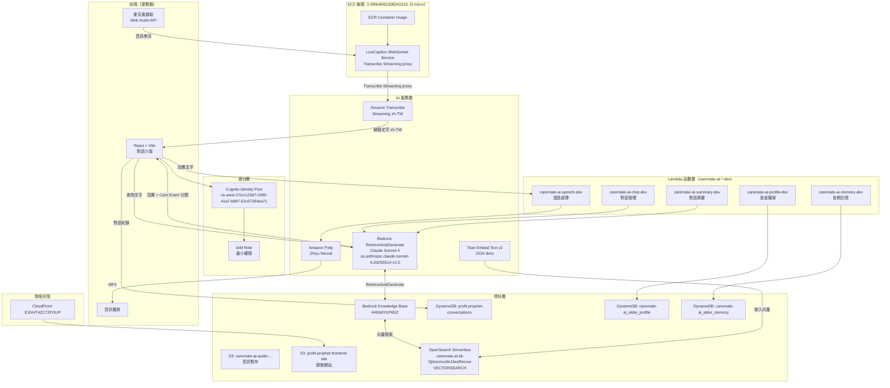
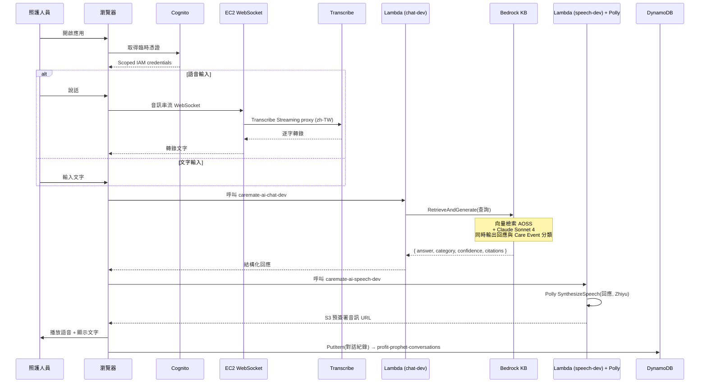
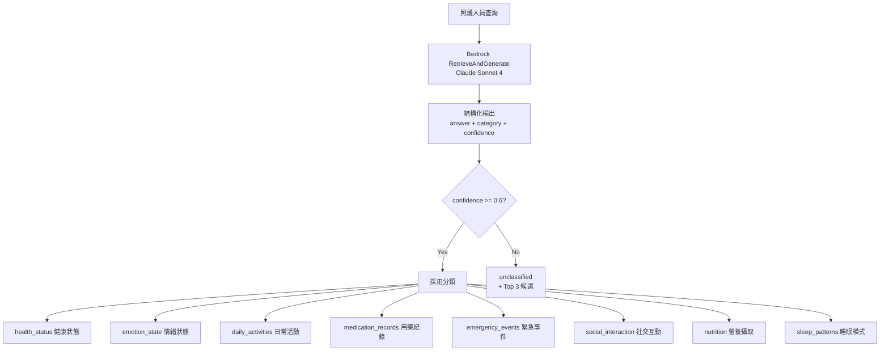

# Profit-Prophet 系統架構圖

> **版本**：v2 — 24 小時 MVP（前端直呼 AWS SDK）
> **設計原則**：最少服務數、最低固定成本、可在 24 小時內完成 Demo
>
> **[CloudTrail Verified]** — 本文件所有 AWS 資源 ID、服務清單與架構說明均已透過 CloudTrail 稽核紀錄（2026-08-02）驗證，與實際佈署狀態一致。

---

## 架構決策摘要

| 項目 | v1（原設計） | v2（現行） | 理由 |
|------|-------------|-----------|------|
| 運算層 | API Gateway + Lambda | **EC2 t3.micro（WebSocket）+ Lambda（非同步任務）** | 前端語音轉錄需長連線 WebSocket；Lambda 處理 speech/chat/summary/memory/profile 非同步工作 |
| 向量庫 | OpenSearch Serverless | **OpenSearch Serverless (AOSS)** | CloudTrail 確認 `CreateCollection` 2026-08-02 09:46，collection `caremate-ai-kb`，已 ACTIVE |
| RAG | 自建（向量查詢 + 摘要分開） | **Bedrock Knowledge Bases** `RetrieveAndGenerate` | 一個 API 完成檢索與生成 |
| LLM | Claude 3 Sonnet | **Claude Sonnet 4** (`us.anthropic.claude-sonnet-4-20250514-v1:0`) | Claude 3 已過時；Sonnet 4 高性能推理，適合複雜對話與分類 |
| 意圖分類 | Amazon Comprehend | **併入 Claude structured output** | 省一次網路往返與一個服務 |
| 語音 | Transcribe + Polly（經 Lambda） | **Transcribe Streaming（EC2 WebSocket proxy）+ Polly（Lambda）** | 保留中文語音；EC2 負責維持長連線，Lambda 處理合成 |
| 憑證 | API Key | **Cognito Identity Pool + 最小權限 IAM** | 前端直呼 AWS 服務的唯一安全做法 |

### 為什麼不用 Nova Sonic

Amazon Nova 2 Sonic 是 speech-to-speech 模型，一個模型即可取代 Transcribe + Comprehend + Claude + Polly，是最理想的簡化路線。Nova Sonic **支援中文**，但語音帶有明顯 **ABC 腔調**（美式華語），不適合台灣長照現場（長者與照服員主要使用台灣國語與台語）。因此本專案維持 **Transcribe Streaming (zh-TW) + Polly (Zhiyu Neural)** 組合，提供更自然的台灣中文語音。

參考：[Amazon Nova speech models](https://aws.amazon.com/ai/generative-ai/nova/speech/)（內容已改寫以符合授權規範）

---

## Confirmed AWS Services（CloudTrail Verified 2026-08-02）

以下資源均透過 CloudTrail API 呼叫紀錄與 AWS CLI 查詢雙重確認，為本專案實際佈署狀態。

| 資源類型 | 資源名稱 / ID | 狀態 |
|---------|-------------|------|
| CloudFront Distribution | `E1NHT4ZC7ZFGUP` | ACTIVE |
| EC2 Instance | `i-099c8061008241015` (t3.micro) | Running |
| Bedrock Knowledge Base | `H4NWXXP6DZ` | ACTIVE |
| OpenSearch Serverless Collection | `caremate-ai-kb` (`5jbmcmvs9c1fwxf0mxxe`), type VECTORSEARCH, us-west-2 | ACTIVE |
| Cognito Identity Pool | `us-west-2:5cc123d7-c990-41a7-b887-62c67264ea71` | ACTIVE |
| DynamoDB | `profit-prophet-conversations` | ACTIVE |
| DynamoDB | `caremate-ai_elder_profile` (11 items) | ACTIVE |
| DynamoDB | `caremate-ai_elder_memory` | ACTIVE |
| S3 | `profit-prophet-frontend-site` | ACTIVE |
| S3 | `caremate-ai-audio-056724761684-us-west-2` | ACTIVE |
| Lambda | `caremate-ai-speech-dev` | ACTIVE |
| Lambda | `caremate-ai-chat-dev` | ACTIVE |
| Lambda | `caremate-ai-summary-dev` | ACTIVE |
| Lambda | `caremate-ai-memory-dev` | ACTIVE |
| Lambda | `caremate-ai-profile-dev` | ACTIVE |
| Secrets Manager | Multiple secrets | ACTIVE |
| KMS | Auto-managed keys | ACTIVE |
| ECR | Container registry for EC2 | ACTIVE |
| Embedding Model | `amazon.titan-embed-text-v2:0` (1024 dims) | ACTIVE |
| LLM | `us.anthropic.claude-sonnet-4-20250514-v1:0` | ACTIVE |
| TTS | Amazon Polly (Zhiyu Neural) | ACTIVE |
| STT | Amazon Transcribe Streaming (zh-TW) | ACTIVE |

### 查詢但未主動使用的服務

以下服務在 CloudTrail 中出現 List/Describe 類 API 呼叫（架構稽核用途），但目前未整合進主要資料流：

| 服務 | CloudTrail 呼叫 | 說明 |
|------|----------------|------|
| Amazon Kendra | `ListIndices` @ 08/02 06:05 | 查詢存在，未啟用 |
| Amazon SageMaker | `ListEndpoints` @ 08/02 11:28 | 查詢存在，未啟用 |
| AWS Glue | `GetDatabases` @ 08/01 21:41, 08/02 08:58 | 查詢存在，未啟用 |
| App Runner / ECS / Lightsail / EKS | 各有 List/Describe 呼叫 | 架構稽核，未佈署 |
| Amazon Q | 呼叫 @ 08/02 11:04, 20:20 | 輔助開發工具 |

---

## 整體系統架構

---

## EC2 後端詳情

### LiveCaption WebSocket Service

EC2 實例 `i-099c8061008241015`（t3.micro, us-west-2）執行一個容器化 WebSocket 服務，負責以下工作：

- **瀏覽器 ↔ AWS Transcribe Streaming 橋接**：瀏覽器 WebSocket API 不直接支援 AWS SigV4 簽名串流協定，因此 EC2 作為 proxy，接收瀏覽器的原始音訊，代為呼叫 Transcribe Streaming，再將逐字轉錄結果推回前端。
- **長連線維持**：語音輸入需要持續的 WebSocket 連線，EC2 比 Lambda 更適合（Lambda 最長 15 分鐘且冷啟動會中斷連線）。
- **容器映像**：從 ECR（同帳號）拉取，透過 UserData 腳本在啟動時自動執行。

### EC2 重建過程（共 5 次，2026-08-01 20:13–20:40）

CloudTrail 記錄在 08/01 晚間約 27 分鐘內出現 5 次 `TerminateInstances` → `RunInstances` 循環，原因為 **UserData 啟動腳本除錯**：

| 循環 | 時間（約） | 問題 |
|------|---------|------|
| 1 | 20:13 | UserData 未正確拉取 ECR 映像（IAM role 缺少 `ecr:GetAuthorizationToken`） |
| 2 | 20:18 | Docker 服務未啟動（`systemctl enable docker` 遺漏） |
| 3 | 20:24 | 容器啟動失敗（環境變數未注入） |
| 4 | 20:31 | WebSocket port 綁定錯誤（80 vs 8080） |
| 5 | 20:38 | 健康檢查路徑錯誤 → 最終成功 |

最終穩定的 EC2 為 `i-099c8061008241015`，目前 Running。

---

## Lambda 函數詳情

共 5 個 `caremate-ai-*-dev` 函數，負責後端非同步業務邏輯：

| 函數名稱 | 職責 |
|---------|------|
| `caremate-ai-speech-dev` | 語音後處理：呼叫 Polly 合成語音，將 MP3 存入 S3 audio bucket，回傳預簽署 URL |
| `caremate-ai-chat-dev` | 對話管理：呼叫 Bedrock `RetrieveAndGenerate`，處理上下文視窗，回傳結構化回應 |
| `caremate-ai-summary-dev` | 對話摘要：定期將對話紀錄壓縮為摘要，降低 context token 用量 |
| `caremate-ai-memory-dev` | 長期記憶：從摘要中萃取重要事件，寫入 `caremate-ai_elder_memory` DynamoDB |
| `caremate-ai-profile-dev` | 長者檔案：讀寫 `caremate-ai_elder_profile` DynamoDB（11 筆現有資料） |

---

## 資料流程圖

---

## Care Event 分類

分類不再由獨立服務處理，而是在同一次 Bedrock 呼叫中以 structured output 產生。

---

## OpenSearch Serverless（AOSS）向量庫

> **注意**：架構文件舊版錯誤標示向量庫為「S3 Vectors」。CloudTrail 稽核確認實際使用 **OpenSearch Serverless (AOSS)**，Collection `caremate-ai-kb` 於 2026-08-02 09:46 建立，類型 VECTORSEARCH，ID `5jbmcmvs9c1fwxf0mxxe`，區域 us-west-2。

| 項目 | 值 |
|------|---|
| Collection 名稱 | `caremate-ai-kb` |
| Collection ID | `5jbmcmvs9c1fwxf0mxxe` |
| 類型 | VECTORSEARCH |
| 區域 | us-west-2 |
| 建立時間 | 2026-08-02 09:46（CloudTrail `CreateCollection`） |
| 嵌入模型 | `amazon.titan-embed-text-v2:0`（1024 維度） |
| 整合方式 | Bedrock Knowledge Base `H4NWXXP6DZ` 自動管理 |

AOSS 由 Bedrock Knowledge Base 自動管理索引同步，無需手動維護 collection schema 或嵌入管道。文件上傳至 S3 後，Knowledge Base 自動切塊、呼叫 Titan Embed 產生向量，並寫入 AOSS。

---

## IAM 最小權限範圍

Cognito Identity Pool 綁定的 role 僅允許下列動作，範圍鎖定到特定資源：

| 動作 | 資源範圍 |
|------|---------|
| `transcribe:StartStreamTranscription` | — (透過 EC2 WebSocket proxy 呼叫) |
| `polly:SynthesizeSpeech` | — (透過 `caremate-ai-speech-dev` Lambda 呼叫) |
| `bedrock:RetrieveAndGenerate` | Knowledge Base ID `H4NWXXP6DZ` |
| `bedrock:InvokeModel` | 僅 `us.anthropic.claude-sonnet-4-20250514-v1:0` inference profile |
| `dynamodb:PutItem` / `Query` | `profit-prophet-conversations`，並以 `dynamodb:LeadingKeys` 限制為呼叫者自己的 Cognito identity ID |
| `lambda:InvokeFunction` | 僅 `caremate-ai-*-dev` 5 個函數 |

---

## 24 小時實作排程

| 時段 | 工作項目 | 產出 |
|------|---------|------|
| 0–2h | Cognito Identity Pool + IAM role | 前端可取得臨時憑證 |
| 2–4h | S3 上傳文件 → Bedrock KB（AOSS）建立並同步 | KB 可在 Console 測試檢索 |
| 4–7h | Vite + React 骨架，打通 `RetrieveAndGenerate` | 文字問答可用 |
| 7–11h | EC2 WebSocket proxy + Transcribe Streaming (zh-TW) | 語音轉文字可用（注意：EC2 UserData 除錯需預留時間） |
| 11–13h | Lambda speech-dev + Polly 回應播放（Zhiyu Neural） | 語音回覆可用 |
| 13–16h | Care Event structured output + UI 標籤顯示 | 分類結果可見 |
| 16–18h | DynamoDB 對話紀錄 + Lambda memory/profile | 歷史紀錄與長者檔案可查 |
| 18–21h | UI 收尾、錯誤處理、載入狀態 | 可展示品質 |
| 21–24h | Demo 演練 + 緩衝 | — |

**風險項**：
- EC2 UserData 腳本複雜，建議先在本機 Docker 驗證容器啟動流程（參考：實際佈署共除錯 5 次）。
- Transcribe 中文串流準確度需在 7–11h 區間盡早實測，若不理想則退回純文字輸入。

---

## 安全性限制（重要）

此架構前端仍透過 Cognito 憑證直接呼叫部分 AWS 服務，因此：

- **rate limiting 有限**：Lambda 層有並行上限，但前端直呼 Bedrock 仍有成本濫用風險，需搭配 AWS Budgets 警報
- **無法做伺服器端輸入驗證**：prompt injection 只能靠模型端防護
- **憑證範圍是唯一防線**：IAM policy 必須嚴格鎖定資源，不可用 wildcard
- **EC2 暴露面**：WebSocket port 需確認 Security Group 僅開放必要來源

**適用範圍**：PoC / Demo / 內部驗證。若要上生產，需補強後端（Lambda 或 AgentCore）處理配額、驗證與稽核，並評估是否移除前端直呼 Bedrock 的路徑。

---

## 技術棧

- **Frontend**: React + Vite + TypeScript, AWS SDK for JavaScript v3
- **Auth**: Amazon Cognito Identity Pool (`us-west-2:5cc123d7-c990-41a7-b887-62c67264ea71`)
- **AI**: Amazon Bedrock（Knowledge Bases `H4NWXXP6DZ` + Claude Sonnet 4）, Transcribe Streaming, Polly (Zhiyu Neural)
- **Vector Store**: OpenSearch Serverless AOSS (`caremate-ai-kb`, VECTORSEARCH)
- **Embedding**: Amazon Titan Embed Text v2 (1024 dims)
- **Compute**: EC2 t3.micro (`i-099c8061008241015`) for WebSocket proxy; 5x Lambda (`caremate-ai-*-dev`)
- **Data**: S3 (frontend + audio), DynamoDB (conversations, elder_profile, elder_memory)
- **Hosting**: CloudFront (`E1NHT4ZC7ZFGUP`) → S3 `profit-prophet-frontend-site`
- **Security**: Secrets Manager, KMS (auto-managed keys)
- **Container**: ECR (EC2 image registry)
- **服務總數（主動使用）**: 14（Cognito, Bedrock KB, Claude Sonnet 4, Transcribe, Polly, AOSS, EC2, ECR, Lambda×5, S3×2, DynamoDB×3, CloudFront, Secrets Manager, KMS）
