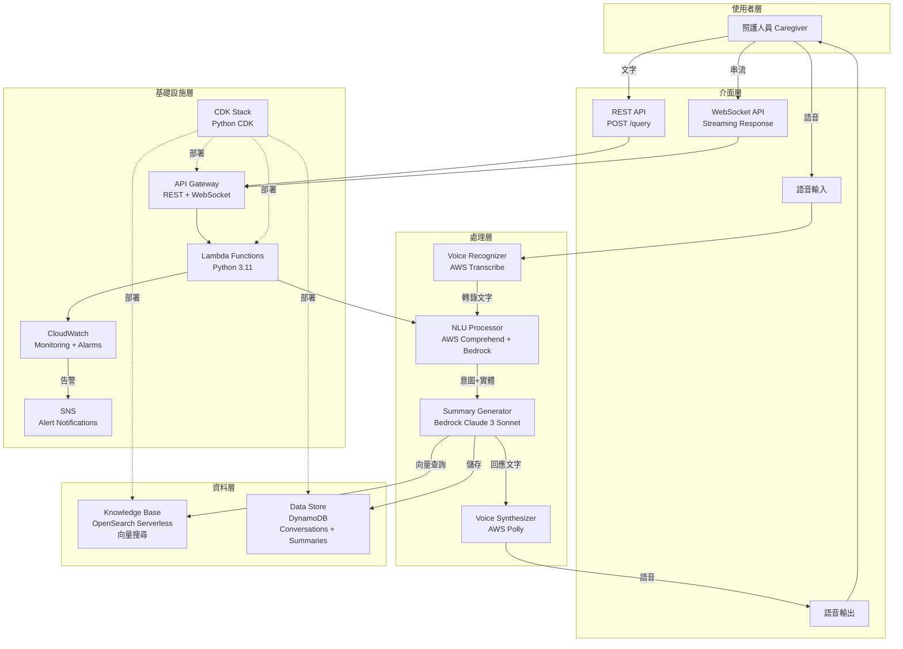
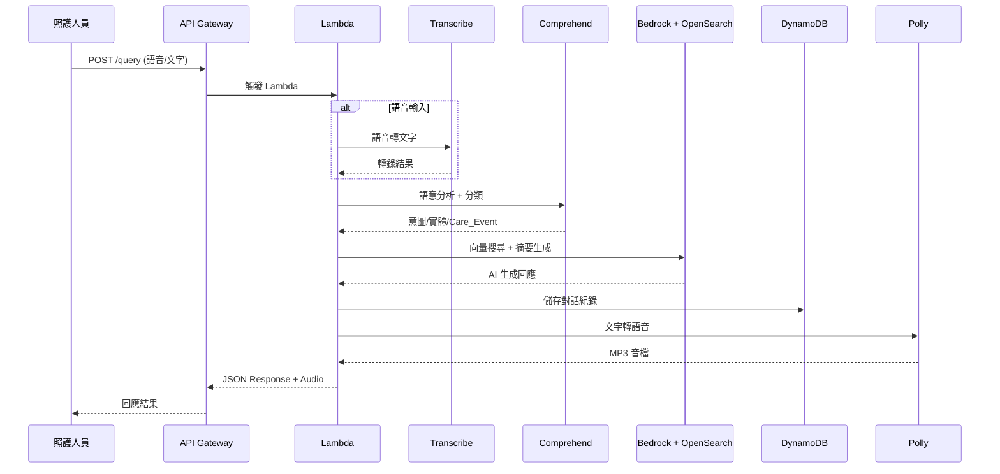
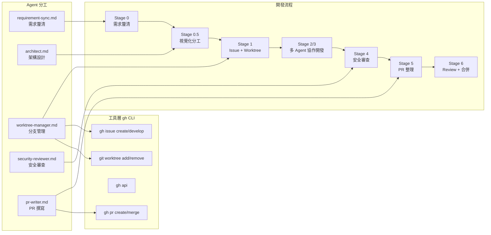
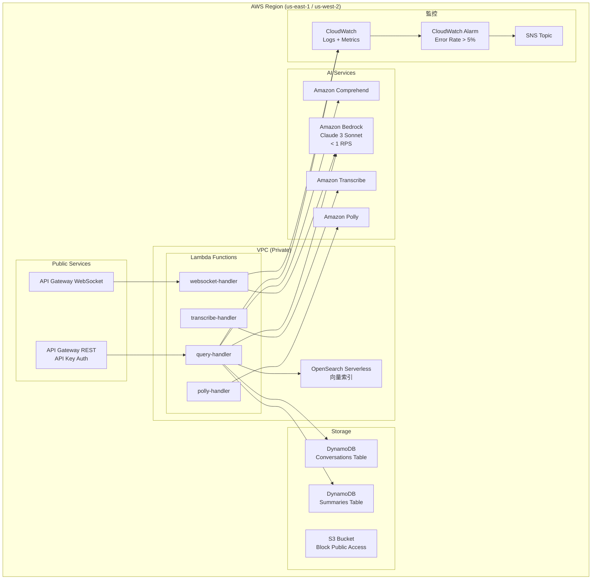
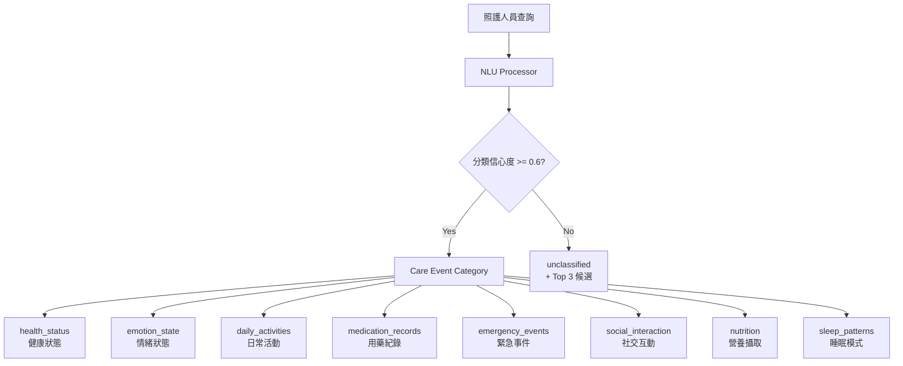
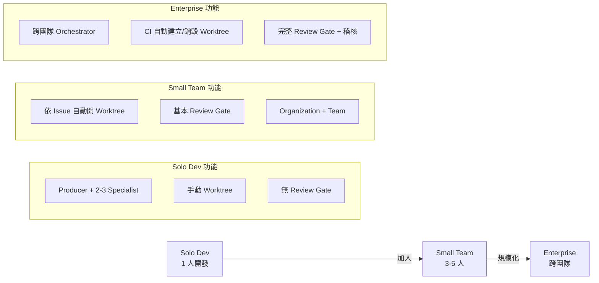

# Profit-Prophet 系統架構圖

## 整體系統架構

```mermaid
graph TB
    subgraph Users["使用者層"]
        CG[照護人員 Caregiver]
    end

    subgraph Interface["介面層"]
        REST[REST API<br/>POST /query]
        WS[WebSocket API<br/>Streaming Response]
        VOICE_IN[語音輸入]
        VOICE_OUT[語音輸出]
    end

    subgraph Processing["處理層"]
        VR[Voice Recognizer<br/>AWS Transcribe]
        NLU[NLU Processor<br/>AWS Comprehend + Bedrock]
        SG[Summary Generator<br/>Bedrock Claude 3 Sonnet]
        VS[Voice Synthesizer<br/>AWS Polly]
    end

    subgraph Data["資料層"]
        KB[Knowledge Base<br/>OpenSearch Serverless<br/>向量搜尋]
        DS[Data Store<br/>DynamoDB<br/>Conversations + Summaries]
    end

    subgraph Infra["基礎設施層"]
        CDK[CDK Stack<br/>Python CDK]
        APIGW[API Gateway<br/>REST + WebSocket]
        LAMBDA[Lambda Functions<br/>Python 3.11]
        CW[CloudWatch<br/>Monitoring + Alarms]
        SNS[SNS<br/>Alert Notifications]
    end

    CG -->|語音| VOICE_IN
    CG -->|文字| REST
    CG -->|串流| WS
    VOICE_IN --> VR
    VR -->|轉錄文字| NLU
    REST --> APIGW
    WS --> APIGW
    APIGW --> LAMBDA
    LAMBDA --> NLU
    NLU -->|意圖+實體| SG
    SG -->|向量查詢| KB
    SG -->|儲存| DS
    SG -->|回應文字| VS
    VS -->|語音| VOICE_OUT
    VOICE_OUT --> CG
    LAMBDA --> CW
    CW -->|告警| SNS
    CDK -.->|部署| APIGW
    CDK -.->|部署| LAMBDA
    CDK -.->|部署| DS
    CDK -.->|部署| KB
```

## 資料流程圖

```mermaid
sequenceDiagram
    participant C as 照護人員
    participant API as API Gateway
    participant L as Lambda
    participant T as Transcribe
    participant NLU as Comprehend
    participant RAG as Bedrock + OpenSearch
    participant DB as DynamoDB
    participant P as Polly

    C->>API: POST /query (語音/文字)
    API->>L: 觸發 Lambda

    alt 語音輸入
        L->>T: 語音轉文字
        T-->>L: 轉錄結果
    end

    L->>NLU: 語意分析 + 分類
    NLU-->>L: 意圖/實體/Care_Event

    L->>RAG: 向量搜尋 + 摘要生成
    RAG-->>L: AI 生成回應

    L->>DB: 儲存對話紀錄
    L->>P: 文字轉語音
    P-->>L: MP3 音檔

    L-->>API: JSON Response + Audio
    API-->>C: 回應結果
```

## GitHub 協作工作流架構

```mermaid
graph LR
    subgraph DevFlow["開發流程"]
        S0[Stage 0<br/>需求釐清] --> S05[Stage 0.5<br/>視覺化分工]
        S05 --> S1[Stage 1<br/>Issue + Worktree]
        S1 --> S2[Stage 2/3<br/>多 Agent 協作開發]
        S2 --> S4[Stage 4<br/>安全審查]
        S4 --> S5[Stage 5<br/>PR 整理]
        S5 --> S6[Stage 6<br/>Review + 合併]
    end

    subgraph Agents["Agent 分工"]
        REQ[requirement-sync.md<br/>需求釐清]
        ARCH[architect.md<br/>架構設計]
        WT[worktree-manager.md<br/>分支管理]
        SEC[security-reviewer.md<br/>安全審查]
        PR[pr-writer.md<br/>PR 撰寫]
    end

    subgraph Tools["工具層 gh CLI"]
        GH_ISSUE[gh issue create/develop]
        GH_PR[gh pr create/merge]
        GH_API[gh api]
        GIT_WT[git worktree add/remove]
    end

    REQ --> S0
    ARCH --> S05
    WT --> S1
    WT --> GH_ISSUE
    WT --> GIT_WT
    SEC --> S4
    PR --> S5
    PR --> GH_PR
```

## AWS 資源部署架構

```mermaid
graph TB
    subgraph Region["AWS Region (us-east-1 / us-west-2)"]
        subgraph VPC["VPC (Private)"]
            subgraph Lambda["Lambda Functions"]
                L1[query-handler]
                L2[websocket-handler]
                L3[transcribe-handler]
                L4[polly-handler]
            end
            OS[OpenSearch Serverless<br/>向量索引]
        end

        subgraph Public["Public Services"]
            APIGW_R[API Gateway REST<br/>API Key Auth]
            APIGW_W[API Gateway WebSocket]
        end

        subgraph Storage["Storage"]
            DDB1[DynamoDB<br/>Conversations Table]
            DDB2[DynamoDB<br/>Summaries Table]
            S3[S3 Bucket<br/>Block Public Access]
        end

        subgraph AI["AI Services"]
            BED[Amazon Bedrock<br/>Claude 3 Sonnet<br/>< 1 RPS]
            TRANS[Amazon Transcribe]
            COMP[Amazon Comprehend]
            POLLY[Amazon Polly]
        end

        subgraph Monitor["監控"]
            CW[CloudWatch<br/>Logs + Metrics]
            ALARM[CloudWatch Alarm<br/>Error Rate > 5%]
            SNS[SNS Topic]
        end
    end

    APIGW_R --> L1
    APIGW_W --> L2
    L1 --> COMP
    L1 --> BED
    L1 --> OS
    L1 --> DDB1
    L1 --> DDB2
    L2 --> BED
    L3 --> TRANS
    L4 --> POLLY
    L1 --> CW
    L2 --> CW
    CW --> ALARM
    ALARM --> SNS
```

## Care Event 分類架構

```mermaid
graph TD
    INPUT[照護人員查詢] --> NLU[NLU Processor]
    NLU --> CLASS{分類信心度 >= 0.6?}

    CLASS -->|Yes| CAT[Care Event Category]
    CLASS -->|No| UNCLASS[unclassified<br/>+ Top 3 候選]

    CAT --> H[health_status<br/>健康狀態]
    CAT --> E[emotion_state<br/>情緒狀態]
    CAT --> D[daily_activities<br/>日常活動]
    CAT --> M[medication_records<br/>用藥紀錄]
    CAT --> EM[emergency_events<br/>緊急事件]
    CAT --> S[social_interaction<br/>社交互動]
    CAT --> N[nutrition<br/>營養攝取]
    CAT --> SL[sleep_patterns<br/>睡眠模式]
```

## 漸進式擴充路線

```mermaid
graph LR
    SOLO[Solo Dev<br/>1 人開發] -->|加人| TEAM[Small Team<br/>3-5 人]
    TEAM -->|規模化| ENT[Enterprise<br/>跨團隊]

    subgraph SOLO_F["Solo Dev 功能"]
        S1[Producer + 2-3 Specialist]
        S2[手動 Worktree]
        S3[無 Review Gate]
    end

    subgraph TEAM_F["Small Team 功能"]
        T1[依 Issue 自動開 Worktree]
        T2[基本 Review Gate]
        T3[Organization + Team]
    end

    subgraph ENT_F["Enterprise 功能"]
        E1[跨團隊 Orchestrator]
        E2[CI 自動建立/銷毀 Worktree]
        E3[完整 Review Gate + 稽核]
    end
```
