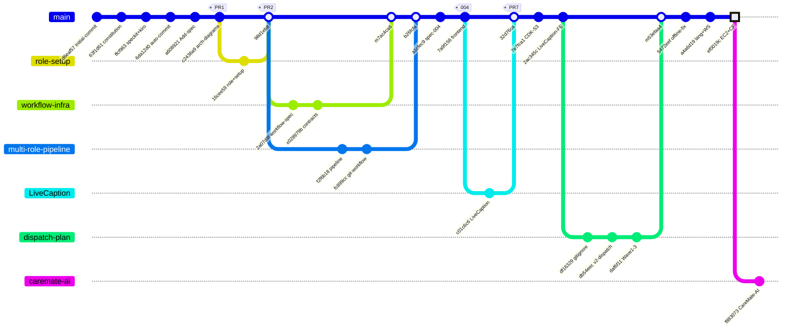

# 📅 Daily Report — 2026-08-01

## ✅ 今日進度 (Done)

### 上午 (09:30–13:00) — 專案初始化 + 多角色 Pipeline

- [`d6eaf57`] Initial commit from Specify template
- [`63f1d61`] docs: add hackathon environment constitution
- [`ffcf963`] chore: add speckit and kiro configuration files
- [`6da12d0`] [Spec Kit] Enable auto-commit for all commands
- [`a608921`] [Spec Kit] Add specification
- [`c2436a9`] [Spec Kit] Add architecture diagrams (PR #1)
- [`16cee59`] [Spec Kit] Add project role and setup files (PR #2)
- [`2a07d8f`] [Spec Kit] Add github-workflow-infrastructure specification
- [`028979b`] [Spec Kit] Add contracts, dispatch task, and task specs docs
- [`f2f6b18`] [Spec Kit] Implement multi-role pipeline steering pack (PR #5)
- [`fc899cc`] [feat] Integrate original git workflow into multi-role pipeline (PR #6)

### 下午 (14:00–18:00) — 前端開發 + v2 規劃

- [`a1cfec9`] [feat] Add spec for voice chat and care record feature
- [`7a9f156`] [feat] Add frontend source code — chat UI, care record, voice input, AWS integrations
- [`c01c6c6`] LiveCaption (PR #7)
- [`7e7fca1`] [feat] Add CDK stack for S3 static website deployment
- [`2ac345c`] [feat] Integrate LiveCaption into frontend + add vite proxy config
- [`df16329`] [chore] Add root .gitignore and untrack __pycache__
- [`db54eec`] [docs] Add v2 dispatch plan and Wave 0 task contracts
- [`daf6f11`] [docs] Add Wave 1-3 task contracts (TASK-005 to TASK-009)
- [`5472eef`] [fix] Show offline notice on LiveCaption page when backend unavailable
- [`a4a6d19`] feat: 語言選項只保留中英文，Transcribe 連線統一走 backend WebSocket

### 晚上 (21:00) — EC2 Backend

- [`ef0019c`] **[feat] EC2 backend + CloudFront routing + Secrets Manager integration**
- [`f883073`] feat: 整合 CareMate AI 智慧長照陪伴系統 (caremate-ai-integration branch)

**變更統計**: 33 commits, ~150 files changed, ~40,000+ insertions

## 🔀 Git Graph (08-01)

## 📋 Speckit 執行紀錄 (08-01)

| Time | Agent | Command | 說明 |
|------|-------|---------|------|
| 09:30 | kiro | `speckit.specify` | 初始化 Profit-Prophet spec + constitution |
| 10:00 | kiro | `speckit.git.feature` | 001-create-role-setup 分支建立 |
| 11:00 | kiro | `speckit.git.feature` | 002-github-workflow-infrastructure 分支建立 |
| 13:00 | kiro | `speckit.git.feature` | 003-multi-role-pipeline 分支建立 |
| 13:02 | kiro | `speckit.implement` | 多角色 pipeline steering pack 實作 |
| 14:43 | kiro | `speckit.specify` | 004-voice-chat-care-record spec 建立 |
| 16:47 | kiro | `speckit.tasks` | github-workflow-infrastructure tasks 生成 |

## 🚧 進行中 (Doing)

- `004-voice-chat-care-record` — 前端元件開發中
- `caremate-ai-integration` — CareMate AI 整合開始
- v2 dispatch plan — 9 個 Task Contracts 已定義

## 🛑 遇到困難 (Blockers)

- 無

## ⏭️ 明日計畫 (Next Steps)

- 005 分支繼續前端元件開發
- 對接 EC2 backend (CloudFront + Secrets Manager)
- 補齊 frontend 測試覆蓋率
- 新增 daily-report skill
